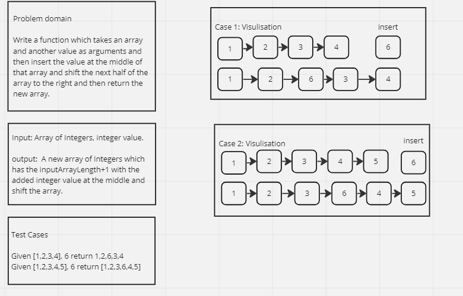
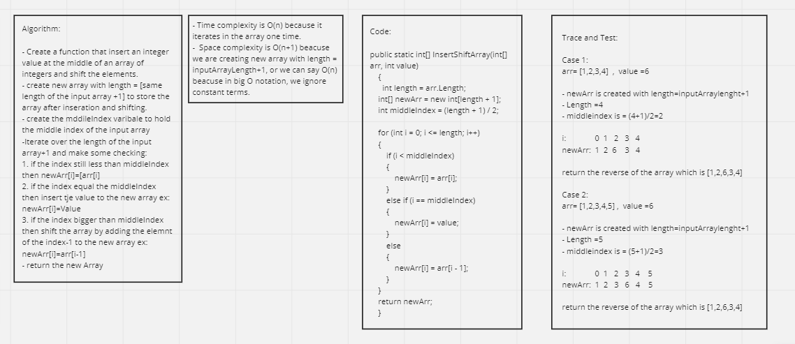

# ArrayInsertShiftChallenge

Write a function called insertShiftArray which takes in an array and a value to be added. Without utilizing any of the built-in methods available to your language, return an array with the new value added at the middle index.

## Whiteboard Process 





## Approach & Efficiency

**Approach:**

1. Calculate the length of the input array arr and store it in the length variable.
2. Create a new array newArr with a length one greater than the input array.
3. Calculate the middle index by dividing the length of newArr by 2, and store it in the middleIndex variable.
4. Iterate over the elements of arr and newArr simultaneously:
5. If the current index is less than the middle index, copy the corresponding element from arr to newArr.
6. If the current index is equal to the middle index, insert the provided value into newArr.
7. If the current index is greater than the middle index, copy the previous element from arr to newArr.
8. Return the modified array newArr as the result.


**Efficiency:**

Time Complexity: O(n), where n is the length of the input array arr. The function iterates over each element of the array once to create the modified array newArr. Therefore, the time complexity is linear with respect to the input size.
Space Complexity: O(n), where n is the length of the input array arr. The function creates a new array newArr with a length one greater than arr, resulting in additional space required. The space complexity grows linearly with the input size.
The function does not utilize any built-in methods available in the language, ensuring a more efficient and independent implementation.


## Solution

Code:


```shell
using System;

class Program
{
    static void Main()
    {
        // Example 1
        int[] arr1 = { 2, 4, 6, -8 };
        int value1 = 5;
        int[] result1 = InsertShiftArray(arr1, value1);
        Console.WriteLine("Input: [2, 4, 6, -8], 5");
        Console.WriteLine("Output: " + string.Join(", ", result1));

        // Example 2
        int[] arr2 = { 42, 8, 15, 23, 42 };
        int value2 = 16;
        int[] result2 = InsertShiftArray(arr2, value2);
        Console.WriteLine("Input: [42, 8, 15, 23, 42], 16");
        Console.WriteLine("Output: " + string.Join(", ", result2));

        // Additional example
        int[] arr3 = { 1, 2, 3 };
        int value3 = 0;
        int[] result3 = InsertShiftArray(arr3, value3);
        Console.WriteLine("Input: [1, 2, 3], 0");
        Console.WriteLine("Output: " + string.Join(", ", result3));
    }
public static int[] InsertShiftArray(int[] arr, int value)
    {
      int length = arr.Length;
    int[] newArr = new int[length + 1];
    int middleIndex = (length + 1) / 2;

    for (int i = 0; i <= length; i++)
    {
        if (i < middleIndex)
        {
            newArr[i] = arr[i];
        }
        else if (i == middleIndex)
        {
            newArr[i] = value;
        }
        else
        {
            newArr[i] = arr[i - 1];
        }
    }
    return newArr;
    }
}
```

The Result:

```shell
Input: [2, 4, 6, -8], 5
Output: 2, 4, 5, 6, -8
Input: [42, 8, 15, 23, 42], 16
Output: 42, 8, 15, 16, 23, 42
Input: [1, 2, 3], 0
Output: 1, 2, 0, 3
```


## Test Cases 

```shell
using Xunit;

public class ProgramTests
{
    [Fact]
    public void InsertShiftArray_HappyPath()
    {
        // Arrange
        int[] arr = { 2, 4, 6, -8 };
        int value = 5;
        int[] expected = { 2, 4, 5, 6, -8 };

        // Act
        int[] result = Program.InsertShiftArray(arr, value);

        // Assert
        Assert.Equal(expected, result);
    }

    [Fact]
    public void InsertShiftArray_EmptyArray()
    {
        // Arrange
        int[] arr = Array.Empty<int>();
        int value = 5;
        int[] expected = { 5 };

        // Act
        int[] result = Program.InsertShiftArray(arr, value);

        // Assert
        Assert.Equal(expected, result);
    }
}
```