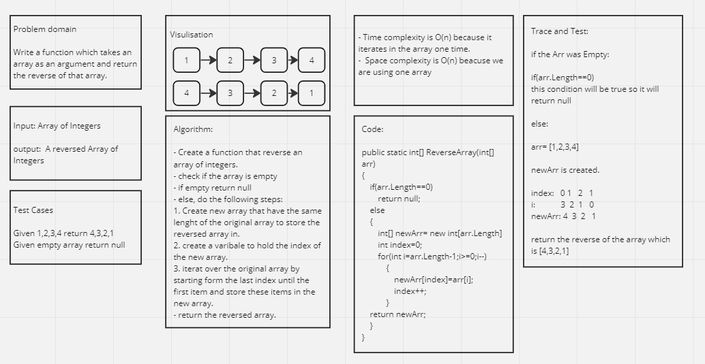

# ArrayReverseChallenge

This Challenge takes an array as an argument. Without utilizing any of the built-in methods available to your language, return an array with elements in reversed order.

## Whiteboard Process 



## Approach & Efficiency

The code follows the following approach:

1. It first checks if the length of the input array is zero. If it is, it returns null since there are no elements to reverse.
2. If the length is not zero, it creates a new integer array newArr with the same length as the input array.
3. It initializes an index variable to 0, which will be used to keep track of the current position in the new array.
4. The code then enters a loop that starts from the last index of the input array and iterates backwards to the first index (0).
5. Within the loop, it assigns the value of the current element in the input array to the corresponding position in the newArr using the index variable.
6. After assigning the value, it increments the index variable.
7. Once the loop is completed, the function returns the newArr, which now contains the reversed elements of the input array.

The time complexity (Big O) of this approach is O(n), where n is the length of the input array. This is because the function needs to iterate through each element of the input array once to reverse it. The space complexity is also O(n) since a new array is created to store the reversed elements.

## Solution

Code:

```shell
using System;

public class Program
{
    public static void Main()
    {
        // Test case 1
        int[] arr1 = { 1, 2, 3, 4, 5 };
        int[] reversedArr1 = ReverseArray(arr1);
        Console.WriteLine("Reversed array: " + string.Join(", ", reversedArr1));

        // Test case 2
        int[] arr2 = { 10, 20, 30, 40, 50, 60 };
        int[] reversedArr2 = ReverseArray(arr2);
        Console.WriteLine("Reversed array: " + string.Join(", ", reversedArr2));

        // Test case 3: Empty array
        int[] arr3 = new int[0];
        int[] reversedArr3 = ReverseArray(arr3);
        Console.WriteLine("Reversed array: " + (reversedArr3 == null ? "null" : ""));

        // Test case 4: Array with a single element
        int[] arr4 = { 100 };
        int[] reversedArr4 = ReverseArray(arr4);
        Console.WriteLine("Reversed array: " + string.Join(", ", reversedArr4));
    }

    public static int[] ReverseArray(int[] arr)
    {
        if (arr.Length == 0)
            return null;
        else
        {
            int[] newArr = new int[arr.Length];
            int index = 0;
            for (int i = arr.Length - 1; i >= 0; i--)
            {
                newArr[index] = arr[i];
                index++;
            }
            return newArr;
        }
    }
}
```

The result adter running the code:

```shell
Reversed array: 5, 4, 3, 2, 1
Reversed array: 60, 50, 40, 30, 20, 10
Reversed array:
Reversed array: 100
```

## Test Cases

```shell

using System;
using Xunit;

public class ReverseArrayTests
{
    [Fact]
    public void ReverseArray_HappyPath()
    {
        // Arrange
        int[] arr = { 1, 2, 3, 4, 5 };
        int[] expected = { 5, 4, 3, 2, 1 };

        // Act
        int[] reversedArr = Program.ReverseArray(arr);

        // Assert
        Assert.Equal(expected, reversedArr);
    }

    [Fact]
    public void ReverseArray_EmptyArray()
    {
        // Arrange
        int[] arr = Array.Empty<int>();

        // Act
        int[] reversedArr = Program.ReverseArray(arr);

        // Assert
        Assert.Null(reversedArr);
    }
}
```