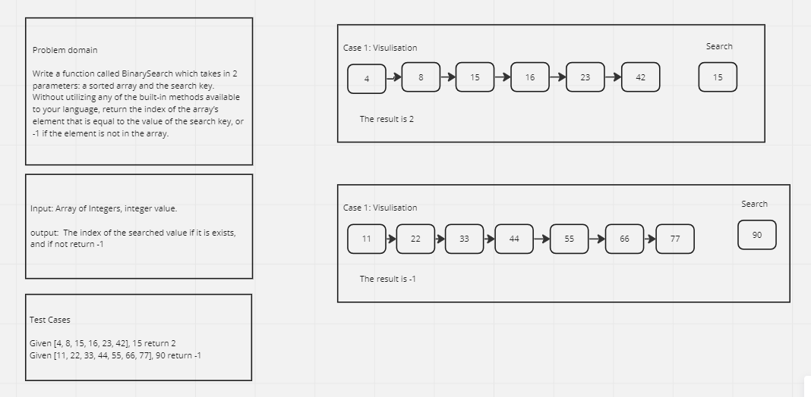
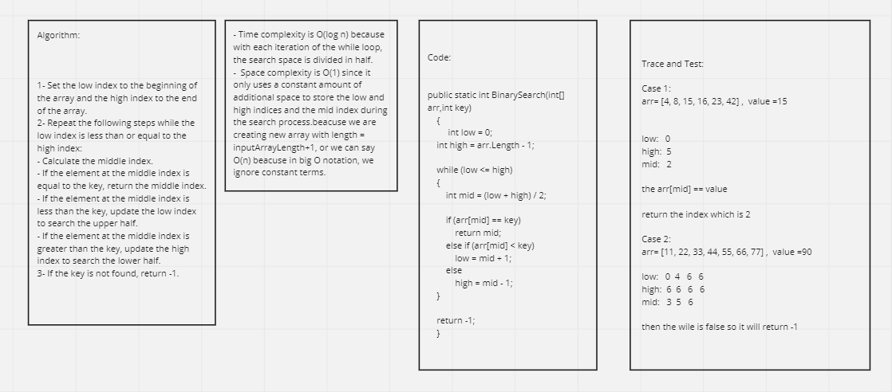

# Binary search in a sorted 1D array

This challenge told us to Write a function called BinarySearch which takes in 2 parameters: a sorted array and the search key. Without utilizing any of the built-in methods available to your language, return the index of the array’s element that is equal to the value of the search key, or -1 if the element is not in the array.

## Whiteboard Process 




## Approach & Efficiency

**Approach:**

The approach of the binary search algorithm is to repeatedly divide the search space in half to efficiently find the target element in a sorted array. By comparing the middle element with the target value, the algorithm determines whether to continue searching in the upper or lower half of the remaining elements. This process continues until the target element is found or the search space is exhausted.

**Efficiency:**

Time Complexity: The time complexity of the binary search algorithm is O(log n), where n is the size of the input array. The algorithm divides the search space in half at each iteration, resulting in a logarithmic time complexity. This makes binary search highly efficient for large arrays.
Space Complexity: The space complexity of the binary search algorithm is O(1) because it uses a constant amount of additional space. It only requires a few variables to keep track of the low and high indices and the middle index during the search process. The space requirements do not increase with the size of the input array.
Binary search is a highly efficient search algorithm for sorted arrays, providing fast retrieval of elements by significantly reducing the search space at each step. It is particularly useful when dealing with large datasets where efficiency is critical.

## Solution

The code:

```shell
using System;

public class HelloWorld
{
    public static void Main(string[] args)
    {
        int[] arr={4, 8, 15, 16, 23,25, 42};
        int value =25;
        Console.WriteLine(BinarySearch(arr,value));
    }
    
    public static int BinarySearch(int[] arr,int key)
    {
         int low = 0;
    int high = arr.Length - 1;

    while (low <= high)
    {
        int mid = (low + high) / 2;

        if (arr[mid] == key)
            return mid;
        else if (arr[mid] < key)
            low = mid + 1;
        else
            high = mid - 1;
    }

    return -1;
    }
}
```


The result After running the code:

```shell
5
```

## Test Cases


```shell
[Fact]
    public void BinarySearch_KeyExists_ReturnsCorrectIndex()
    {
        // Arrange
        int[] arr = { 4, 8, 15, 16, 23, 42 };
        int key = 15;
        int expectedIndex = 2;

        // Act
        int resultIndex = BinarySearch(arr, key);

        // Assert
        Assert.Equal(expectedIndex, resultIndex);
    }

    [Fact]
    public void BinarySearch_KeyDoesNotExist_ReturnsMinusOne()
    {
        // Arrange
        int[] arr = { 4, 8, 15, 16, 23, 42 };
        int key = 25;
        int expectedIndex = -1;

        // Act
        int resultIndex = BinarySearch(arr, key);

        // Assert
        Assert.Equal(expectedIndex, resultIndex);
    }
```