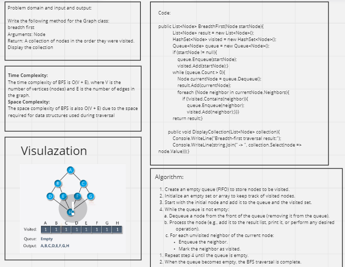

# Graph Breadth First

## Whiteboard Process 



## Approach & Efficiency

**Approach:**

Breadth-First Search (BFS) is a graph traversal algorithm that systematically explores the vertices (nodes) of a graph in a level-by-level fashion, starting from a given source node. The primary idea behind BFS is to visit all nodes at a given level before moving on to nodes at the next level. The approach can be summarized as follows:

1. Initialize a queue (FIFO) and a set or array to keep track of visited nodes.
2. Start from the source node, enqueue it into the queue, and mark it as visited.
3. While the queue is not empty:
* Dequeue the front node from the queue.
* Process the dequeued node (e.g., add it to a result list or perform an operation).
* Enqueue all unvisited neighbors of the dequeued node and mark them as visited.
4. Repeat step 3 until the queue is empty.
5. When the queue becomes empty, the BFS traversal is complete, and you have visited all reachable nodes from the source node.

**Efficiency:**

Time Complexity:

* The time complexity of BFS is O(V + E), where V is the number of vertices (nodes) and E is the number of edges in the graph.
* In the worst case, BFS explores all nodes and edges of the graph once.
* The "V" term accounts for visiting all nodes, and the "E" term accounts for traversing all edges.

Space Complexity:

* The space complexity of BFS is O(V) for the additional data structures used during traversal.
* The main space-consuming data structures are the queue, which can hold at most V nodes (in the case of a complete graph), and the set or array to keep track of visited nodes, which also has a space complexity of O(V).
* The overall space complexity is dominated by the space needed to store the visited nodes and nodes in the queue.

Efficiency Summary:

* BFS is an efficient algorithm for traversing and exploring graphs.
* It guarantees that it visits all nodes in the shortest possible distance order from the source node.
* BFS is well-suited for finding shortest paths in unweighted graphs and for tasks that require exploring the neighborhood of a node.
* Its time and space complexity makes it practical for many real-world applications, and it is often the algorithm of choice when you need to explore graphs systematically.

## Solution

Graph Code:

```shell
public class Graph
    {
        private List<Node> nodes;

        public Graph()
        {
            nodes = new List<Node>();
        }

        public void AddNode(string value)
        {
            nodes.Add(new Node(value));
        }

        public void AddEdge(Node node1, Node node2)
        {
            node1.Neighbors.Add(node2);
            node2.Neighbors.Add(node1);
        }

        public List<Node> BreadthFirst(Node startNode)
        {
            List<Node> result = new List<Node>();
            HashSet<Node> visited = new HashSet<Node>();
            Queue<Node> queue = new Queue<Node>();

            if (startNode != null)
            {
                queue.Enqueue(startNode);
                visited.Add(startNode);
            }

            while (queue.Count > 0)
            {
                Node currentNode = queue.Dequeue();
                result.Add(currentNode);

                foreach (Node neighbor in currentNode.Neighbors)
                {
                    if (!visited.Contains(neighbor))
                    {
                        queue.Enqueue(neighbor);
                        visited.Add(neighbor);
                    }
                }
            }

            return result;
        }

        public void DisplayCollection(List<Node> collection)
        {
            Console.WriteLine("Breadth-first traversal result:");
            Console.WriteLine(string.Join(" -> ", collection.Select(node => node.Value)));
        }
    }
```

Main Function Code:

```shell
static void Main(string[] args)
        {
            Graph graph = new Graph();
            Node nodeA = new Node("Pandora");
            Node nodeB = new Node("Arendelle");
            Node nodeC = new Node("Metroville");
            Node nodeD = new Node("Monstroplolis");
            Node nodeE = new Node("Narnia");
            Node nodeF = new Node("Naboo");

            graph.AddNode("Pandora");
            graph.AddNode("Arendelle");
            graph.AddNode("Metroville");
            graph.AddNode("Monstroplolis");
            graph.AddNode("Narnia");
            graph.AddNode("Naboo");

            graph.AddEdge(nodeA, nodeB);
            graph.AddEdge(nodeB, nodeC);
            graph.AddEdge(nodeB, nodeD);
            graph.AddEdge(nodeC, nodeE);
            graph.AddEdge(nodeC, nodeF);
            graph.AddEdge(nodeD, nodeE);
            graph.AddEdge(nodeD, nodeF);

            // Test 1: Breadth-first traversal starting from nodeA
            List<Node> result = graph.BreadthFirst(nodeA);
            graph.DisplayCollection(result); // Output: A -> B -> C -> D -> E -> F

            Console.ReadKey();
        }
```

## Test Cases

```shell
public class UnitTest1
    {
        [Fact]
        public void TestBreadthFirstTraversalStartingFromNodeA()
        {
            Graph graph = new Graph();
            Node nodeA = new Node("Pandora");
            Node nodeB = new Node("Arendelle");
            Node nodeC = new Node("Metroville");
            Node nodeD = new Node("Monstroplolis");
            Node nodeE = new Node("Narnia");
            Node nodeF = new Node("Naboo");

            graph.AddNode("Pandora");
            graph.AddNode("Arendelle");
            graph.AddNode("Metroville");
            graph.AddNode("Monstroplolis");
            graph.AddNode("Narnia");
            graph.AddNode("Naboo");

            graph.AddEdge(nodeA, nodeB);
            graph.AddEdge(nodeB, nodeC);
            graph.AddEdge(nodeB, nodeD);
            graph.AddEdge(nodeC, nodeE);
            graph.AddEdge(nodeC, nodeF);
            graph.AddEdge(nodeD, nodeE);
            graph.AddEdge(nodeD, nodeF);

            List<Node> result = graph.BreadthFirst(nodeA);

            Assert.Equal(6, result.Count); // There should be 6 nodes in the result.
            Assert.Equal("Pandora", result[0].Value); // First node should be Pandora.
            Assert.Equal("Arendelle", result[1].Value); // Second node should be Arendelle.
            Assert.Equal("Metroville", result[2].Value); // Third node should be Metroville.
            Assert.Equal("Monstroplolis", result[3].Value); // Fourth node should be Monstroplolis.
            Assert.Equal("Narnia", result[4].Value); // Fifth node should be Narnia.
            Assert.Equal("Naboo", result[5].Value); // Sixth node should be Naboo.
        }

        [Fact]
        public void TestEmptyGraph()
        {
            Graph graph = new Graph();
            Node nodeA = new Node("Pandora");

            List<Node> result = graph.BreadthFirst(nodeA);

            Assert.Single(result); // There should be only one node in the result, which is the start node.
            Assert.Equal("Pandora", result[0].Value);
        }

        [Fact]
        public void TestGraphWithSingleNode()
        {
            Graph graph = new Graph();
            Node nodeA = new Node("Pandora");

            graph.AddNode("Pandora");

            List<Node> result = graph.BreadthFirst(nodeA);

            Assert.Single(result); // There should be only one node in the result, which is the start node.
            Assert.Equal("Pandora", result[0].Value);
        }

        [Fact]
        public void TestDisconnectedGraph()
        {
            Graph graph = new Graph();
            Node nodeA = new Node("Pandora");
            Node nodeB = new Node("Arendelle");

            graph.AddNode("Pandora");
            graph.AddNode("Arendelle");

            List<Node> result = graph.BreadthFirst(nodeA);

            Assert.Single(result); // There should be only one node in the result, which is the start node.
            Assert.Equal("Pandora", result[0].Value);
        }
    }
```
