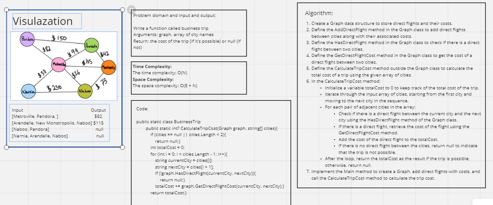

# Graph Business Trip

## Whiteboard Process



## Approach & Efficiency

**Approach:**

1. Data Structure for Direct Flights: We start by creating a Graph data structure to represent direct flights between cities and their associated costs. The Graph class contains methods for adding direct flights, checking for direct flights between cities, and getting the cost of a direct flight.
2. Calculating Trip Cost: The main algorithm is implemented in the CalculateTripCost method. This method takes an array of cities as input and calculates the total cost of a trip by iterating through the cities and checking for direct flights between adjacent cities. It accumulates the cost if a direct flight is available and returns null if the trip is not possible due to the absence of direct flights.
3. Iterative City Check: The algorithm iterates through the input array of cities, starting from the first city and moving to the next city in sequence. For each pair of adjacent cities, it checks if there is a direct flight. If a direct flight exists, it retrieves the cost and adds it to the total cost.
4. Handling Trip Possibility: If a direct flight is not available between any pair of adjacent cities, the algorithm returns null to indicate that the trip is not possible. Otherwise, it returns the calculated total cost as the result.

**Efficiency:**

Time Complexity:

1. Adding Direct Flights: The time complexity for adding direct flights to the graph is O(1) per flight. If there are E direct flights to be added, the overall time complexity for adding direct flights is O(E).
2. Calculating Trip Cost: The time complexity for calculating the trip cost is O(N), where N is the number of cities in the input array. In the worst case, the algorithm iterates through all cities in the input array once.
3. Overall Time Complexity: The total time complexity is dominated by the calculation of the trip cost. Therefore, the overall time complexity is O(N).

Space Complexity:

1. Storing Direct Flights: The space complexity for storing direct flights and their costs in the Graph data structure is O(E), where E is the number of direct flights. This space is determined by the number of direct flights added to the graph.
2. Input Array of Cities: The space complexity for storing the input array of cities is O(N), where N is the number of cities in the array.
3. Additional Space: The additional space complexity used within the CalculateTripCost method is O(1) since it does not depend on the input size.
4. Overall Space Complexity: The overall space complexity is O(E + N), where E is the space required for direct flights, and N is the space required for the input array of cities. In the worst case, the space complexity is O(E) if there are many direct flights, and the input cities array is not counted towards this space complexity.

The algorithm is efficient and can handle trips with direct flights while checking for trip feasibility in a linear time complexity based on the number of cities.

## Solution

Function Code:

```shell
public class Graph
    {
        private Dictionary<string, Dictionary<string, int>> flights;

        public Graph()
        {
            flights = new Dictionary<string, Dictionary<string, int>>();
        }

        public void AddDirectFlight(string city1, string city2, int cost)
        {
            if (!flights.ContainsKey(city1))
            {
                flights[city1] = new Dictionary<string, int>();
            }

            flights[city1][city2] = cost;
        }

        public bool HasDirectFlight(string city1, string city2)
        {
            return flights.ContainsKey(city1) && flights[city1].ContainsKey(city2);
        }

        public int GetDirectFlightCost(string city1, string city2)
        {
            return flights[city1][city2];
        }
    }

    public static class BusinessTrip
    {
        public static int? CalculateTripCost(Graph graph, string[] cities)
        {
            if (cities == null || cities.Length < 2)
            {
                return null;
            }

            int totalCost = 0;

            for (int i = 0; i < cities.Length - 1; i++)
            {
                string currentCity = cities[i];
                string nextCity = cities[i + 1];

                if (!graph.HasDirectFlight(currentCity, nextCity))
                {
                    return null;
                }

                totalCost += graph.GetDirectFlightCost(currentCity, nextCity);
            }

            return totalCost;
        }
    }
```


Main Function Code:

```shell
static void Main(string[] args)
        {
            Graph graph = new Graph();

            // Adding direct flights and their costs
            graph.AddDirectFlight("Metroville", "Pandora", 82);
            graph.AddDirectFlight("Arendelle", "New Monstropolis", 23);
            graph.AddDirectFlight("New Monstropolis", "Naboo", 92);

            // Test 1: Possible trip with direct flights
            int? result1 = BusinessTrip.CalculateTripCost(graph, new string[] { "Metroville", "Pandora" });
            Console.WriteLine(result1); // Output: 82

            // Test 2: Possible trip with direct flights
            int? result2 = BusinessTrip.CalculateTripCost(graph, new string[] { "Arendelle", "New Monstropolis", "Naboo" });
            Console.WriteLine(result2); // Output: 115

            // Test 3: Trip not possible (no direct flight between Naboo and Pandora)
            int? result3 = BusinessTrip.CalculateTripCost(graph, new string[] { "Naboo", "Pandora" });
            Console.WriteLine(result3); // Output: null

            // Test 4: Trip not possible (no direct flight between Narnia and Arendelle)
            int? result4 = BusinessTrip.CalculateTripCost(graph, new string[] { "Narnia", "Arendelle", "Naboo" });
            Console.WriteLine(result4); // Output: null

            Console.ReadKey();
        }
```

## Test Cases

```shell
public class UnitTest1
    {
        [Fact]
        public void TestPossibleTripWithDirectFlights()
        {
            Graph graph = new Graph();
            graph.AddDirectFlight("Metroville", "Pandora", 82);
            graph.AddDirectFlight("Arendelle", "New Monstropolis", 23);
            graph.AddDirectFlight("New Monstropolis", "Naboo", 92);

            int? result = BusinessTrip.CalculateTripCost(graph, new string[] { "Metroville", "Pandora" });
            Assert.Equal(82, result);
        }

        [Fact]
        public void TestPossibleTripWithDirectFlights_MultipleCities()
        {
            Graph graph = new Graph();
            graph.AddDirectFlight("Metroville", "Pandora", 82);
            graph.AddDirectFlight("Arendelle", "New Monstropolis", 23);
            graph.AddDirectFlight("New Monstropolis", "Naboo", 92);

            int? result = BusinessTrip.CalculateTripCost(graph, new string[] { "Arendelle", "New Monstropolis", "Naboo" });
            Assert.Equal(115, result);
        }

        [Fact]
        public void TestTripNotPossible_NoDirectFlight()
        {
            Graph graph = new Graph();
            graph.AddDirectFlight("Metroville", "Pandora", 82);
            graph.AddDirectFlight("Arendelle", "New Monstropolis", 23);

            int? result = BusinessTrip.CalculateTripCost(graph, new string[] { "Naboo", "Pandora" });
            Assert.Null(result);
        }

        [Fact]
        public void TestTripNotPossible_SingleCity()
        {
            Graph graph = new Graph();
            graph.AddDirectFlight("Metroville", "Pandora", 82);

            int? result = BusinessTrip.CalculateTripCost(graph, new string[] { "Metroville" });
            Assert.Null(result);
        }

        [Fact]
        public void TestTripNotPossible_EmptyCitiesArray()
        {
            Graph graph = new Graph();

            int? result = BusinessTrip.CalculateTripCost(graph, new string[] { });
            Assert.Null(result);
        }

        [Fact]
        public void TestTripNotPossible_NullCitiesArray()
        {
            Graph graph = new Graph();

            int? result = BusinessTrip.CalculateTripCost(graph, null);
            Assert.Null(result);
        }
    }
```
