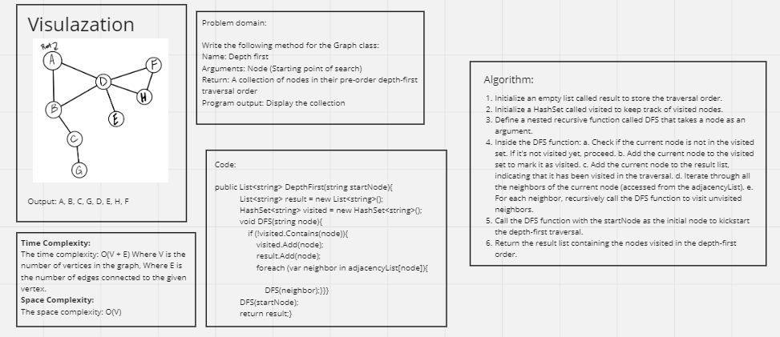

# Graph Business Trip

## Whiteboard Process



## Approach & Efficiency

**Approach:**
1. The approach used in this depth-first traversal algorithm is recursive and follows the principles of depth-first search (DFS) on a graph. Here are the key steps:
2. Initialize an empty list called result to store the traversal order.
3. Initialize a HashSet called visited to keep track of visited nodes.
4. Define a nested recursive function called DFS that takes a node as an argument.
Inside the DFS function:
* Check if the current node is not in the visited set. If it's not visited yet, proceed.
* Add the current node to the visited set to mark it as visited.
* Add the current node to the result list, indicating that it has been visited in the traversal.
* Iterate through all the neighbors of the current node (accessed from the adjacencyList).
* For each neighbor, recursively call the DFS function to visit unvisited neighbors.

5. Call the DFS function with the startNode as the initial node to kickstart the depth-first traversal.
6. Return the result list containing the nodes visited in the depth-first order.

The algorithm ensures that it explores as deeply as possible along each branch before backtracking to explore other branches, resulting in a pre-order depth-first traversal order.

**Efficiency:**

The efficiency of this depth-first traversal algorithm can be analyzed in terms of time complexity and space complexity.

Time Complexity:
* In the worst case, the algorithm visits every vertex and edge once. Therefore, the time complexity is O(V + E), where V is the number of vertices (nodes) in the graph, and E is the number of edges.

* Space Complexity:
* The space complexity is determined by:			
   * The space used by the result list to store the traversal order, which is O(V) as it can contain all vertices in the graph.
   * The space used by the visited set to keep track of visited nodes, which is also O(V) in the worst case.
   * The space used by the recursive call stack during the depth-first traversal, which can be up to O(V) in the worst case for a graph with a single long path.

Therefore, the overall space complexity is O(V) due to the space used by the result, visited set, and the call stack.

In summary, this depth-first traversal algorithm is efficient and has a time complexity of O(V + E) and a space complexity of O(V). It's suitable for traversing graphs with a moderate number of vertices and edges.

## Solution

Function Code:

```shell
public class Graph
    {
        private Dictionary<string, List<string>> adjacencyList;

        public Graph()
        {
            adjacencyList = new Dictionary<string, List<string>>();
        }

        // Add a vertex to the graph
        public void AddVertex(string vertex)
        {
            if (!adjacencyList.ContainsKey(vertex))
            {
                adjacencyList[vertex] = new List<string>();
            }
        }

        // Add an edge between two vertices
        public void AddEdge(string from, string to)
        {
            if (!adjacencyList.ContainsKey(from) || !adjacencyList.ContainsKey(to))
            {
                throw new ArgumentException("Both vertices must exist in the graph.");
            }

            adjacencyList[from].Add(to);
        }


        public List<string> GetVertices()
        {
            List<string> vertices = new List<string>(adjacencyList.Keys);
            return vertices;
        }

        // Get neighbors of a vertex
        public List<string> GetNeighbors(string vertex)
        {
            if (!adjacencyList.ContainsKey(vertex))
            {
                throw new ArgumentException("Vertex not found in the graph.");
            }

            List<string> neighbors = adjacencyList[vertex];
            return neighbors;
        }

        // Depth First Traversal
        public List<string> DepthFirst(string startNode)
        {
            List<string> result = new List<string>();
            HashSet<string> visited = new HashSet<string>();

            void DFS(string node)
            {
                if (!visited.Contains(node))
                {
                    visited.Add(node);
                    result.Add(node);

                    foreach (var neighbor in adjacencyList[node])
                    {
                        DFS(neighbor);
                    }
                }
            }

            DFS(startNode);
            return result;
        }
    }
```

Main Function:

```shell
static void Main(string[] args)
        {
            Graph graph = new Graph();

            graph.AddVertex("A");
            graph.AddVertex("B");
            graph.AddVertex("C");
            graph.AddVertex("D");
            graph.AddVertex("E");
            graph.AddVertex("F");
            graph.AddVertex("G");
            graph.AddVertex("H");

            graph.AddEdge("A", "B");
            graph.AddEdge("A", "D");
            graph.AddEdge("B", "C");
            graph.AddEdge("B", "D");
            graph.AddEdge("C", "G");
            graph.AddEdge("D", "E");
            graph.AddEdge("D", "H");
            graph.AddEdge("D", "F");
            graph.AddEdge("F", "H");

            List<string> traversalResult = graph.DepthFirst("A");

            Console.WriteLine("Depth-First Traversal Result: " + string.Join(", ", traversalResult));


            Console.ReadKey();
        }
```

## Test Cases

```shell
public class UnitTest1
    {
        [Fact]
        public void AddVertex_ShouldAddVertexToGraph()
        {
            // Arrange
            Graph graph = new Graph();

            // Act
            graph.AddVertex("A");
            graph.AddVertex("B");

            // Assert
            Assert.Contains("A", graph.GetVertices());
            Assert.Contains("B", graph.GetVertices());
        }

        [Fact]
        public void AddEdge_ShouldAddEdgeBetweenVertices()
        {
            // Arrange
            Graph graph = new Graph();
            graph.AddVertex("A");
            graph.AddVertex("B");

            // Act
            graph.AddEdge("A", "B");

            // Assert
            Assert.Contains("B", graph.GetNeighbors("A"));
        }

        [Fact]
        public void AddEdge_ShouldThrowException_WhenEitherVertexDoesNotExist()
        {
            // Arrange
            Graph graph = new Graph();

            // Act & Assert
            Assert.Throws<ArgumentException>(() => graph.AddEdge("A", "B"));
        }

        [Fact]
        public void DepthFirst_ShouldTraverseGraphCorrectly()
        {
            // Arrange
            Graph graph = new Graph();
            graph.AddVertex("A");
            graph.AddVertex("B");
            graph.AddVertex("C");
            graph.AddVertex("D");
            graph.AddVertex("E");
            graph.AddEdge("A", "B");
            graph.AddEdge("A", "C");
            graph.AddEdge("B", "D");
            graph.AddEdge("C", "E");

            // Act
            List<string> traversalResult = graph.DepthFirst("A");

            // Assert
            Assert.Equal(new List<string> { "A", "B", "D", "C", "E" }, traversalResult);
        }
    }
```
