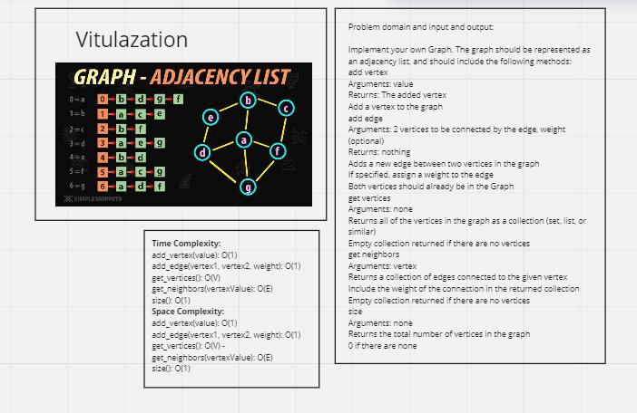
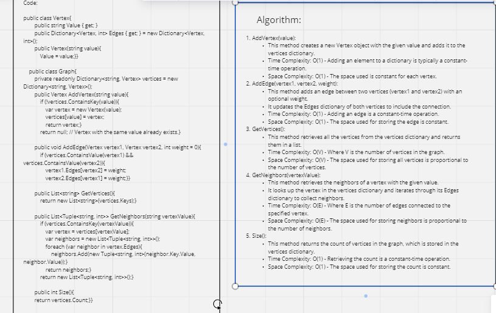

# Graph

## Whiteboard Process 




---

## Approach & Efficiency

**Approach:**
The provided graph code implements a graph data structure using an adjacency list representation. It consists of two primary classes:

1. Vertex: Represents a vertex in the graph. Each vertex has a unique value and a dictionary (Edges) to store its adjacent vertices and edge weights.

2. Graph: Represents the graph itself and provides methods for adding vertices, adding edges, retrieving vertices, retrieving neighbors, and determining the size of the graph.

**Efficiency:**

1. Adding a Vertex (AddVertex):

* Time Complexity: O(1)
* Space Complexity: O(1)
* This operation is efficient as it involves creating a new Vertex object and adding it to the vertices dictionary.

2. Adding an Edge (AddEdge):

* Time Complexity: O(1)
* Space Complexity: O(1)
* Adding an edge between two vertices involves updating their respective Edges dictionaries. This operation is typically constant time.

3. Getting All Vertices (GetVertices):

* Time Complexity: O(V)
* Space Complexity: O(V)
* Retrieving all vertices requires iterating through the vertices dictionary, where V is the number of vertices in the graph.

4. Getting Neighbors of a Vertex (GetNeighbors):

* Time Complexity: O(E)
* Space Complexity: O(E)
* Retrieving neighbors of a vertex involves iterating through its Edges dictionary, where E is the number of edges connected to the vertex.

5. Getting the Size of the Graph (Size):

* Time Complexity: O(1)
* Space Complexity: O(1)
* Calculating the size of the graph is a constant-time operation, as it involves returning the count of vertices stored in the vertices dictionary.

Overall, the provided code is efficient for basic graph operations. The time and space complexities are generally acceptable for small to moderate-sized graphs. However, for very large graphs with a high number of vertices and edges, more optimized data structures and algorithms might be required to achieve better performance.

---

## Solution

Class Implementation:

```shell
public class Vertex
    {
        public string Value { get; }
        public Dictionary<Vertex, int> Edges { get; } = new Dictionary<Vertex, int>();

        public Vertex(string value)
        {
            Value = value;
        }
    }

    public class Graph
    {
        private readonly Dictionary<string, Vertex> vertices = new Dictionary<string, Vertex>();

        public Vertex AddVertex(string value)
        {
            if (!vertices.ContainsKey(value))
            {
                var vertex = new Vertex(value);
                vertices[value] = vertex;
                return vertex;
            }
            return null; // Vertex with the same value already exists.
        }

        public void AddEdge(Vertex vertex1, Vertex vertex2, int weight = 0)
        {
            if (vertices.ContainsValue(vertex1) && vertices.ContainsValue(vertex2))
            {
                vertex1.Edges[vertex2] = weight;
                vertex2.Edges[vertex1] = weight;
            }
        }

        public List<string> GetVertices()
        {
            return new List<string>(vertices.Keys);
        }

        public List<Tuple<string, int>> GetNeighbors(string vertexValue)
        {
            if (vertices.ContainsKey(vertexValue))
            {
                var vertex = vertices[vertexValue];
                var neighbors = new List<Tuple<string, int>>();
                foreach (var neighbor in vertex.Edges)
                {
                    neighbors.Add(new Tuple<string, int>(neighbor.Key.Value, neighbor.Value));
                }
                return neighbors;
            }
            return new List<Tuple<string, int>>();
        }

        public int Size()
        {
            return vertices.Count;
        }
    }
```


Main Function:

```shell
static void Main()
        {
            var graph = new Graph();
            var vertexA = graph.AddVertex("A");
            var vertexB = graph.AddVertex("B");
            var vertexC = graph.AddVertex("C");

            graph.AddEdge(vertexA, vertexB, 2);
            graph.AddEdge(vertexB, vertexC, 3);
            graph.AddEdge(vertexA, vertexC, 1);

            Console.WriteLine("Vertices: " + string.Join(", ", graph.GetVertices()));
            Console.WriteLine("Neighbors of A: " + string.Join(", ", graph.GetNeighbors("A")));
            Console.WriteLine("Size: " + graph.Size());

            Console.ReadKey();
        }
```

---

## Test Cases

```shell
public class UnitTest1
    {
        [Fact]
        public void CanAddVertexToGraph()
        {
            var graph = new GraphCode.Graph();
            var vertexA = graph.AddVertex("A");

            Assert.NotNull(vertexA);
            Assert.Equal("A", vertexA.Value);
        }

        [Fact]
        public void CanAddEdgeToGraph()
        {
            var graph = new GraphCode.Graph();
            var vertexA = graph.AddVertex("A");
            var vertexB = graph.AddVertex("B");

            graph.AddEdge(vertexA, vertexB, 2);

            Assert.Contains(vertexB, vertexA.Edges.Keys);
            Assert.Contains(vertexA, vertexB.Edges.Keys);
        }

        [Fact]
        public void CanRetrieveAllVerticesFromGraph()
        {
            var graph = new GraphCode.Graph();
            graph.AddVertex("A");
            graph.AddVertex("B");
            graph.AddVertex("C");

            var vertices = graph.GetVertices();

            Assert.Contains("A", vertices);
            Assert.Contains("B", vertices);
            Assert.Contains("C", vertices);
        }

        [Fact]
        public void CanRetrieveNeighborsFromGraph()
        {
            var graph = new GraphCode.Graph();
            var vertexA = graph.AddVertex("A");
            var vertexB = graph.AddVertex("B");
            var vertexC = graph.AddVertex("C");
            graph.AddEdge(vertexA, vertexB, 2);
            graph.AddEdge(vertexB, vertexC, 3);

            var neighborsA = graph.GetNeighbors("A");
            var neighborsB = graph.GetNeighbors("B");

            Assert.Contains(new Tuple<string, int>("B", 2), neighborsA);
            Assert.Contains(new Tuple<string, int>("A", 2), neighborsB);
            Assert.Contains(new Tuple<string, int>("C", 3), neighborsB);
        }

        [Fact]
        public void CanRetrieveSizeOfGraph()
        {
            var graph = new GraphCode.Graph();
            graph.AddVertex("A");
            graph.AddVertex("B");
            graph.AddVertex("C");

            var size = graph.Size();

            Assert.Equal(3, size);
        }

        [Fact]
        public void CanReturnGraphWithOneVertexAndEdge()
        {
            var graph = new GraphCode.Graph();
            var vertexA = graph.AddVertex("A");
            graph.AddEdge(vertexA, vertexA, 1);

            var vertices = graph.GetVertices();
            var neighborsA = graph.GetNeighbors("A");
            var size = graph.Size();

            Assert.Single(vertices);
            Assert.Contains(new Tuple<string, int>("A", 1), neighborsA);
            Assert.Equal(1, size);
        }
    }
```
