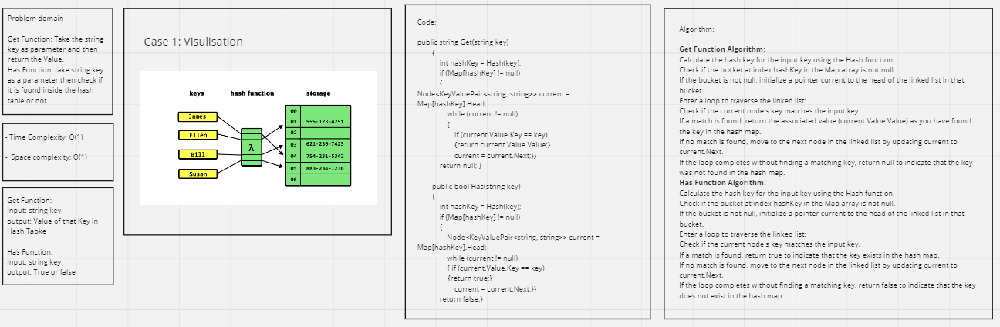

# Hash Tables

## Whiteboard Process 



---

## Approach & Efficiency


### Get Function Approach & Efficiency:

**Approach:**

Calculate the hash key for the input key using the Hash function.
Traverse the linked list in the specified bucket to find the key.
Return the associated value if the key is found; otherwise, return null.

**Efficiency:**

Time Complexity:
In the average case, where there are few collisions and the linked lists are short, the time complexity is O(1) for calculating the hash and finding the key within the linked list.
In the worst case, where there are many collisions and all keys hash to the same bucket (linked list becomes very long), the time complexity is O(n), where n is the number of elements in the linked list for the specific bucket.

Space Complexity:
The space complexity is O(1) as it does not depend on the size of the input data but rather on the internal data structures and variables used within the function.

### Has Function Approach & Efficiency:

**Approach:**

Calculate the hash key for the input key using the Hash function.
Traverse the linked list in the specified bucket to find the key.
Return true if the key is found; otherwise, return false.

**Efficiency:**

Time Complexity:
In the average case, where there are few collisions and the linked lists are short, the time complexity is O(1) for calculating the hash and finding the key within the linked list.
In the worst case, where there are many collisions and all keys hash to the same bucket (linked list becomes very long), the time complexity is O(n), where n is the number of elements in the linked list for the specific bucket.

Space Complexity:
The space complexity is O(1) as it does not depend on the size of the input data but rather on the internal data structures and variables used within the function.

In summary, the Get and Has functions both have an average-case time complexity of O(1) for hash calculation and key lookup within the linked list. However, in the worst-case scenario with many collisions, the time complexity can become O(n) due to the need to traverse a lengthy linked list. The space complexity for both functions is O(1) as it is not influenced by the size of the input data but by the internal variables and data structures used in the functions.

---

## Solution

Main Code:

```shell
static void Main(string[] args)
        {
            // Create a Hashtable
                // Create a new HashMap with a specified size.
                Hashtable hashMap = new Hashtable(4);

                // Set key-value pairs in the HashMap.
                hashMap.Set("name", "Ahmad");
                hashMap.Set("age", "30");
                hashMap.Set("Kids", "2");

                // Print the contents of the HashMap.
                Console.WriteLine("HashMap Contents:");
                hashMap.Print();
                Console.WriteLine();

                // Test the Get method.
                string name = hashMap.Get("name");
                Console.WriteLine("Name: " + name);

                string profession = hashMap.Get("Major");
                Console.WriteLine("Major: " + profession); // Should print "Profession: null"
                Console.WriteLine();

                // Test the Has method.
                bool hasAge = hashMap.Has("age");
                Console.WriteLine("Has Age: " + hasAge); // Should print "Has Age: True"

                bool hasMajor = hashMap.Has("Major");
                Console.WriteLine("Has Major: " + hasMajor); // Should print "Has Profession: False"

                
            
        }
```

---

## Test Cases

```shell
public class UnitTest1
    {
        [Fact]
        public void TestSetAndGet()
        {
            var hashMap = new Hashtable(3);
            hashMap.Set("name", "Ahmad");
            Assert.Equal("Ahmad", hashMap.Get("name"));
        }

        [Fact]
        public void GetNullForNotExistentKey()
        {
            var hashMap = new Hashtable(10);
            Assert.Null(hashMap.Get("age"));
        }

        [Fact]
        public void TestHas()
        {
            var hashMap = new Hashtable(10);
            hashMap.Set("age", "18");
            Assert.True(hashMap.Has("age"));
            Assert.False(hashMap.Has("Major"));
        }

        [Fact]
        public void TestForCollisions()
        {
            var hashMap = new Hashtable(10);
            // These keys will hash to the same bucket
            hashMap.Set("key1", "value1");
            hashMap.Set("k1y", "value2");
            Assert.Equal("value1", hashMap.Get("key1"));
            Assert.Equal("value2", hashMap.Get("k1y"));
        }

        [Fact]
        public void SuccessfullyHashesKeyToInRangeValue()
        {
            Hashtable hashMap = new Hashtable(50); // Increase capacity for better testing
            string key = "testKey";
            int hash = hashMap.Hash(key);
            Assert.InRange(hash, 0, 49); // Assuming Capacity is 100.
        }
        [Fact]
        public void SuccessfullyRetrievesValueFromBucketWithCollision()
        {
            var hashMap = new Hashtable(10);
            // These keys will hash to the same bucket
            hashMap.Set("book1", "value1");
            hashMap.Set("bo1ok", "value2");
            Assert.Equal("value2", hashMap.Get("bo1ok"));
        }
    }
```
