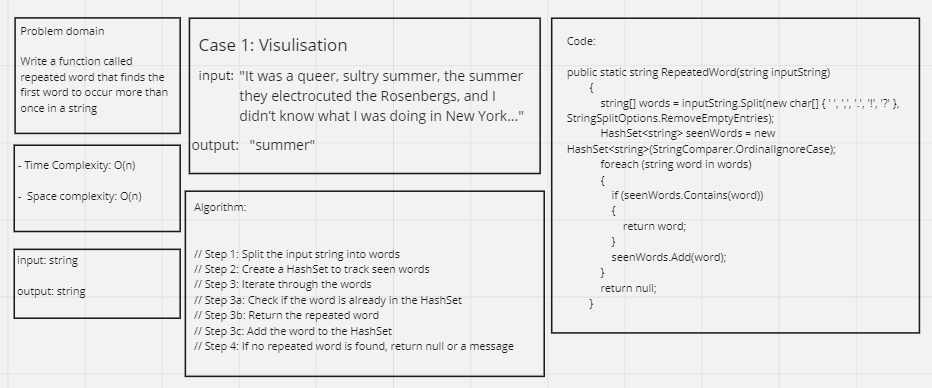

# Hashmap Repeated Word

## Whiteboard Process 



---

## Approach & Efficiency

The RepeatedWord function is designed to find the first word that occurs more than once in a given input string. It uses a HashSet to efficiently track and identify repeated words. Here's a breakdown of the approach and its efficiency:

**Approach:**

1. Splitting the Input String:

* The input string is split into words using the Split method, which splits the string using spaces, commas, periods, exclamation marks, and question marks as delimiters.
This step creates an array of words.
Creating a HashSet:

* A HashSet is used to efficiently store and track unique words.
The HashSet is configured to be case-insensitive using StringComparer.OrdinalIgnoreCase. This ensures that words with different letter casing are considered the same.
Iterating Through Words:

* The function iterates through the array of words one by one.

2. For each word:

* It checks if the word is already in the HashSet (seenWords).
* If the word is found in the HashSet, it means that the word has occurred before, and it is returned as the first repeated word.
* If the word is not found in the HashSet, it is added to the HashSet, indicating that it has been seen.

3. Returning Result:

* If no repeated word is found after iterating through all the words, the function returns null or a suitable message, indicating that there are no repeated words in the input string.

**Efficiency:**

1. Time Complexity: The time complexity of this function is O(n), where n is the number of words in the input string.

* Splitting the string into words takes O(n) time.
* Iterating through the words and performing HashSet operations takes O(n) time in the worst case, as each word is checked once.
* Overall, the time complexity is linear with respect to the number of words in the input.

2. Space Complexity: The space complexity is also O(n) in the worst case.

* The words array stores all the words from the input string, which requires O(n) space.
* The HashSet stores unique words, and in the worst case, it can store all n words from the input string, requiring O(n) space.
* Overall, the space complexity is linear with respect to the number of words in the input.

This function provides an efficient solution for finding the first repeated word in a string while maintaining case insensitivity.

---

## Solution

Code:

```shell
public class HashmapRepeatedWord
    {
        public static string RepeatedWord(string inputString)
        {
            // Step 1: Split the input string into words
            string[] words = inputString.Split(new char[] { ' ', ',', '.', '!', '?' }, StringSplitOptions.RemoveEmptyEntries);

            // Step 2: Create a HashSet to track seen words
            HashSet<string> seenWords = new HashSet<string>(StringComparer.OrdinalIgnoreCase); // Ignore case

            // Step 3: Iterate through the words
            foreach (string word in words)
            {
                // Step 3a: Check if the word is already in the HashSet
                if (seenWords.Contains(word))
                {
                    return word; // Step 3b: Return the repeated word
                }
                // Step 3c: Add the word to the HashSet
                seenWords.Add(word);
            }

            // Step 4: If no repeated word is found, return null or a message
            return null;
        }
    }
```

Main Function Code:

```shell
static void Main(string[] args)
        {
            
            Console.WriteLine(HashmapRepeatedWord.RepeatedWord("Once upon a time, there was a brave princess who...")); // Output: "a"
            Console.WriteLine(HashmapRepeatedWord.RepeatedWord("It was the best of times, it was the worst of times, it was the age of wisdom, it was the age of foolishness...")); // Output: "it"
            Console.WriteLine(HashmapRepeatedWord.RepeatedWord("It was a queer, sultry summer, the summer they electrocuted the Rosenbergs...")); // Output: "summer"
        }
```

## Test Cases

```shell
public class UnitTest1
    {
        [Fact]
        public void RepeatedWord_ReturnsFirstRepeatedWord_WhenInputContainsRepeatedWord()
        {
            // Arrange
            string inputString = "It was the best of times, it was the worst of times.";

            // Act
            string result = HashmapRepeatedWord.RepeatedWord(inputString);

            // Assert
            Assert.Equal("it", result, ignoreCase: true); // Ensure case-insensitive comparison
        }

        [Fact]
        public void RepeatedWord_ReturnsNull_WhenInputDoesNotContainRepeatedWord()
        {
            // Arrange
            string inputString = "Once upon a time, there was an excpected brave princess.";

            // Act
            string result = HashmapRepeatedWord.RepeatedWord(inputString);

            // Assert
            Assert.Null(result);
        }

        [Fact]
        public void RepeatedWord_ReturnsNull_WhenInputIsEmpty()
        {
            // Arrange
            string inputString = string.Empty;

            // Act
            string result = HashmapRepeatedWord.RepeatedWord(inputString);

            // Assert
            Assert.Null(result);
        }
    }
```
