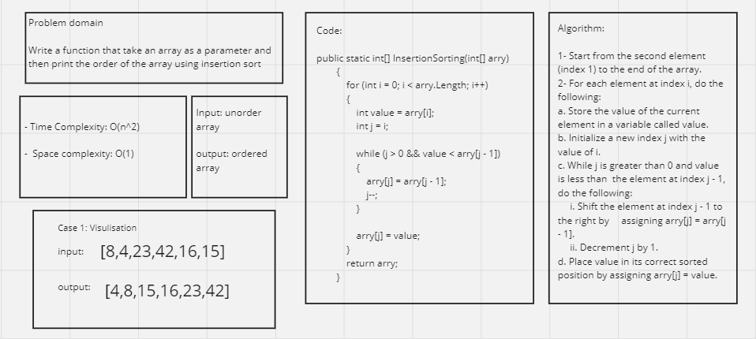

# Insertion Sort

## Whiteboard Process 



## Approach & Efficiency

**Approach**

Insertion Sort is a simple comparison-based sorting algorithm that builds the final sorted array one element at a time. It divides the input array into two parts: a sorted portion and an unsorted portion. The algorithm iterates through the unsorted portion, comparing each element to the elements in the sorted portion and inserting it into its correct position. The process continues until the entire array is sorted.

The key steps of the Insertion Sort algorithm are as follows:

1. Start from the second element (index 1) and compare it with the elements to its left.
2. If the current element is smaller, shift the larger elements to the right to create space.
3. Insert the current element into the correct position within the sorted portion.
4. Repeat the process for each element in the unsorted portion until the array is fully sorted.

**Efficiency**

The efficiency of the Insertion Sort algorithm can be analyzed in terms of time complexity and space complexity:

***Time Complexity:***

Best Case: If the input array is already nearly sorted, the inner while loop rarely executes, resulting in fewer comparisons and shifts. In this case, the time complexity approaches O(n).
Worst Case: In the worst case, when the input array is in reverse order, the algorithm needs to make maximum comparisons and shifts for each element. The worst-case time complexity is O(n^2).
Average Case: The average-case time complexity of Insertion Sort is also O(n^2), making it less efficient than more advanced sorting algorithms like QuickSort or MergeSort.

***Space Complexity:***
Insertion Sort is an in-place sorting algorithm, meaning it doesn't require extra memory for sorting and operates directly on the input array. The space complexity is O(1), indicating that the memory usage is constant regardless of the input size.

Summary

Insertion Sort is a straightforward sorting algorithm that works well for small arrays, partially sorted arrays, or situations where memory usage is a concern. However, its time complexity makes it less suitable for larger datasets. While it's not the most efficient sorting algorithm, its simplicity and minimal memory usage can make it useful in specific scenarios.

## Solution

Insertion Sort Function Code:

```shell
public static int[] InsertionSorting(int[] arry)
        {
            for (int i = 0; i < arry.Length; i++)
            {
                int value = arry[i];
                int j = i;

                while (j > 0 && value < arry[j - 1])
                {
                    arry[j] = arry[j - 1];
                    j--;
                }

                arry[j] = value;
            }
            return arry;
        }
```

Main Function Code:

```shell
static void Main(string[] args)
        {
            int[] sampleArray = { 8, 4, 23, 42, 16, 15 };
            int[] sampleArray2 = { 20, 18, 12, 8, 5, -2 };
            int[] sampleArray3 = { 5, 12, 7, 5, 5, 7 };

            InsertionSort.InsertionSorting(sampleArray);
            Console.WriteLine("Sorted Array: " + string.Join(", ", sampleArray));

            InsertionSort.InsertionSorting(sampleArray2);
            Console.WriteLine("Secend Sorted Array: " + string.Join(", ", sampleArray2));

            InsertionSort.InsertionSorting(sampleArray3);
            Console.WriteLine("third Sorted Array: " + string.Join(", ", sampleArray3));
        }
```

## Test Cases

```shell
[Theory]
        [InlineData(new[] { 8, 4, 23, 42, 16, 15 })]
        [InlineData(new[] { 20, 18, 12, 8, 5, -2 })]
        [InlineData(new[] { 5, 12, 7, 5, 5, 7 })]
        [InlineData(new[] { 2, 3, 5, 7, 13, 11 })]
        public void TestArrayIsSorted(int[] inputArray)
        {
            int[] sortedArray = InsertionSortCode.InsertionSort.InsertionSorting(inputArray);
            Assert.True(IsArraySorted(sortedArray));
        }

        public bool IsArraySorted(int[] arr)
        {
            for (int i = 1; i < arr.Length; i++)
            {
                if (arr[i] < arr[i - 1])
                {
                    return false;
                }
            }
            return true;
        }
```
