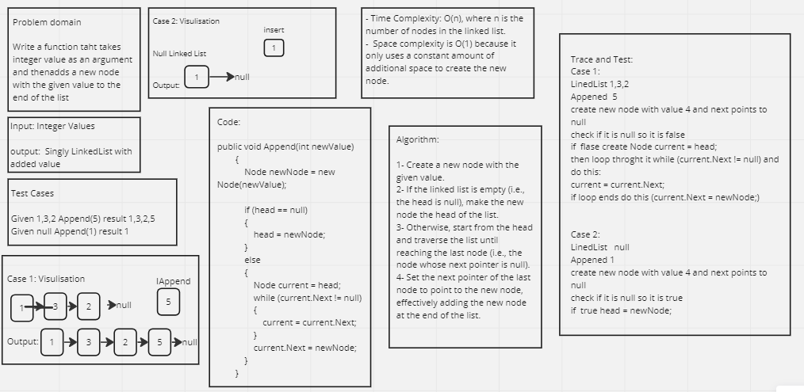

# linked-list-insertions

## Whiteboard Process 


.PNG)
.PNG)
.PNG)
.PNG)

---

## Approach & Efficiency

The given code implements a linked list and performs various operations such as appending a node, inserting a node before a given node, and inserting a node after a given node. It also includes a Display method to visualize the linked list.

1. Appending a Node:

* The Append method adds a new node with the given value to the end of the list.
* It iterates through the linked list to find the last node.
* Time Complexity: O(n) - It iterates through the linked list once.
* Space Complexity: O(1) - It uses a constant amount of additional space.

2. Inserting a Node Before a Given Node:

* The InsertBefore method adds a new node with the given new value immediately before the first node that has the specified value.
* It checks if the list is empty or if the value to insert before is the head node.
* Otherwise, it traverses the linked list to find the node with the specified value.
* Time Complexity: O(n) - It iterates through the linked list once in the worst case.
* Space Complexity: O(1) - It uses a constant amount of additional space.

3. Inserting a Node After a Given Node:

* The InsertAfter method adds a new node with the given new value immediately after the first node that has the specified value.
* It checks if the list is empty.
* Otherwise, it traverses the linked list to find the node with the specified value.
* Time Complexity: O(n) - It iterates through the linked list once in the worst case.
* Space Complexity: O(1) - It uses a constant amount of additional space.

4. Displaying the Linked List:

* The Display method creates a string representation of the linked list by iterating through each node.
* It appends each node's value to a StringBuilder.
* Time Complexity: O(n) - It iterates through the linked list once.
* Space Complexity: O(n) - It creates a string representation of the linked list.

Overall, the code implements the linked list operations efficiently. The time and space complexities are reasonable, making the operations suitable for most practical scenarios.

---

## Solution

Code:

```shell
using System;
using System.Text;

namespace LinkedListCodeImplementation
{
    public class Program
    {
        static void Main(string[] args)
        {
            LinkedList myLinkedList = new LinkedList();
            myLinkedList.Append(1);
            myLinkedList.Append(3);
            myLinkedList.Append(2);
            myLinkedList.Append(2);
            string listString1 = myLinkedList.Display();
            Console.WriteLine(listString1);

            myLinkedList.Append(5);
            string listString2 = myLinkedList.Display();
            Console.WriteLine(listString2);
            myLinkedList.Display();

            myLinkedList.InsertBefore(3, 5);
            string listString3 = myLinkedList.Display();
            Console.WriteLine(listString3);
            myLinkedList.Display();

            myLinkedList.InsertBefore(1, 5);
            string listString4 = myLinkedList.Display();
            Console.WriteLine(listString4);
            myLinkedList.Display();

            myLinkedList.InsertBefore(2, 5);
            string listString5 = myLinkedList.Display();
            Console.WriteLine(listString5);
            myLinkedList.Display();

            try
            {
                myLinkedList.InsertBefore(4, 5);
            }
            catch (Exception e)
            {
                Console.WriteLine(e.Message);
            }

            myLinkedList.InsertAfter(3, 5);
            string listString6 = myLinkedList.Display();
            Console.WriteLine(listString6);
            myLinkedList.Display();

            myLinkedList.InsertAfter(2, 5);
            string listString7 = myLinkedList.Display();
            Console.WriteLine(listString7);
            myLinkedList.Display();

            try
            {
                myLinkedList.InsertAfter(4, 5);
            }
            catch (Exception e)
            {
                Console.WriteLine(e.Message);
            }
            Console.ReadKey();
        }
    }

    public class Node
    {
        public int Value { get; set; }
        public Node Next { get; set; }

        public Node(int value)
        {
            Value = value;
            Next = null;
        }
    }

    public class LinkedList
    {
        private Node head;

        public LinkedList()
        {
            head = null;
        }

        public void Append(int newValue)
        {
            Node newNode = new Node(newValue);

            if (head == null)
            {
                head = newNode;
            }
            else
            {
                Node current = head;
                while (current.Next != null)
                {
                    current = current.Next;
                }
                current.Next = newNode;
            }
        }

        public void InsertBefore(int value, int newValue)
        {
            Node newNode = new Node(newValue);

            if (head == null)
            {
                throw new Exception("Cannot insert before. List is empty.");
            }
            else if (head.Value == value)
            {
                newNode.Next = head;
                head = newNode;
            }
            else
            {
                Node current = head;
                while (current.Next != null && current.Next.Value != value)
                {
                    current = current.Next;
                }
                if (current.Next == null)
                {
                    throw new Exception($"Node with value {value} not found.");
                }
                newNode.Next = current.Next;
                current.Next = newNode;
            }
        }

        public void InsertAfter(int value, int newValue)
        {
            Node newNode = new Node(newValue);

            if (head == null)
            {
                throw new Exception("Cannot insert after. List is empty.");
            }
            Node current = head;
            while (current != null && current.Value != value)
            {
                current = current.Next;
            }
            if (current == null)
            {
                throw new Exception($"Node with value {value} not found.");
            }
            newNode.Next = current.Next;
            current.Next = newNode;
        }

        public string Display()
        {
            StringBuilder sb = new StringBuilder();
            Node current = head;
            while (current != null)
            {
                sb.Append(current.Value).Append(" -> ");
                current = current.Next;
            }
            sb.Append("X");
            return sb.ToString();
        }
    }
}
```

The result after running the code:

```shell
1 -> 3 -> 2 -> 2 -> X
1 -> 3 -> 2 -> 2 -> 5 -> X
1 -> 5 -> 3 -> 2 -> 2 -> 5 -> X
5 -> 1 -> 5 -> 3 -> 2 -> 2 -> 5 -> X
5 -> 1 -> 5 -> 3 -> 5 -> 2 -> 2 -> 5 -> X
Node with value 4 not found.
5 -> 1 -> 5 -> 3 -> 5 -> 5 -> 2 -> 2 -> 5 -> X
5 -> 1 -> 5 -> 3 -> 5 -> 5 -> 2 -> 5 -> 2 -> 5 -> X
Node with value 4 not found.
```


---

## Test Cases

```shell
using System.Collections.Generic;
using LinkedListCodeImplementation;

namespace LinkedListTestImplementation
{
    public class UnitTest1
    {
        [Fact]
        public void Append_SingleNode_SuccessfullyAddsNodeToEndOfList()
        {
            // Arrange
            LinkedList linkedList = new LinkedList();

            // Act
            linkedList.Append(1);

            // Assert
            Assert.Equal("1 -> X", linkedList.Display());
        }

        [Fact]
        public void Append_MultipleNodes_SuccessfullyAddsNodesToEndOfList()
        {
            // Arrange
            LinkedList linkedList = new LinkedList();

            // Act
            linkedList.Append(1);
            linkedList.Append(3);
            linkedList.Append(2);

            // Assert
            Assert.Equal("1 -> 3 -> 2 -> X", linkedList.Display());
        }

        [Fact]
        public void InsertBefore_MiddleNode_SuccessfullyInsertsNodeBeforeMiddleNode()
        {
            // Arrange
            LinkedList linkedList = new LinkedList();
            linkedList.Append(1);
            linkedList.Append(3);
            linkedList.Append(2);

            // Act
            linkedList.InsertBefore(3, 5);

            // Assert
            Assert.Equal("1 -> 5 -> 3 -> 2 -> X", linkedList.Display());
        }

        [Fact]
        public void InsertBefore_FirstNode_SuccessfullyInsertsNodeBeforeFirstNode()
        {
            // Arrange
            LinkedList linkedList = new LinkedList();
            linkedList.Append(1);
            linkedList.Append(3);
            linkedList.Append(2);

            // Act
            linkedList.InsertBefore(1, 5);

            // Assert
            Assert.Equal("5 -> 1 -> 3 -> 2 -> X", linkedList.Display());
        }

        [Fact]
        public void InsertAfter_MiddleNode_SuccessfullyInsertsNodeAfterMiddleNode()
        {
            // Arrange
            LinkedList linkedList = new LinkedList();
            linkedList.Append(1);
            linkedList.Append(3);
            linkedList.Append(2);

            // Act
            linkedList.InsertAfter(3, 5);

            // Assert
            Assert.Equal("1 -> 3 -> 5 -> 2 -> X", linkedList.Display());
        }

        [Fact]
        public void InsertAfter_LastNode_SuccessfullyInsertsNodeAfterLastNode()
        {
            // Arrange
            LinkedList linkedList = new LinkedList();
            linkedList.Append(1);
            linkedList.Append(3);
            linkedList.Append(2);

            // Act
            linkedList.InsertAfter(2, 5);

            // Assert
            Assert.Equal("1 -> 3 -> 2 -> 5 -> X", linkedList.Display());
        }
    }
}
```
