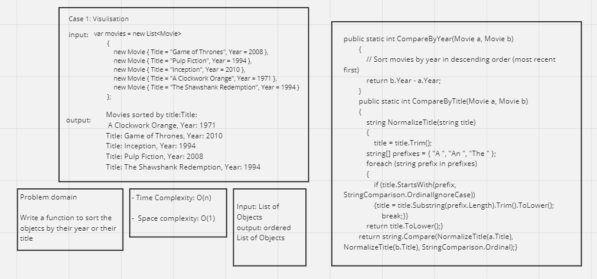

# Sorting Object


This code provides a `MovieComparators` class with a `CompareByTitle` function, allowing you to sort a list of `Movie` objects by their titles while ignoring common articles like "A," "An," or "The."

## Code Structure

### Movie Class
- The `Movie` class represents a movie object with properties for `Title`, `Year`, and `Genres`.

### MovieComparators Class
- The `MovieComparators` class contains the `CompareByTitle` function, which takes two `Movie` objects and sorts them by title while ignoring articles.

## Usage

To use the `CompareByTitle` function, follow these steps:

1. Include the `Movie` and `MovieComparators` classes in your C# project.

2. Create a list of `Movie` objects that you want to sort by title.

3. Use the `Sort` method on the list of movies and pass the `CompareByTitle` function as the comparison delegate. This will sort the movies in-place.

```csharp
var movies = new List<Movie>
{
    new Movie { Title = "The Dark Knight", Year = 2008 },
    new Movie { Title = "Pulp Fiction", Year = 1994 },
    new Movie { Title = "Inception", Year = 2010 },
    new Movie { Title = "A Clockwork Orange", Year = 1971 },
    new Movie { Title = "The Shawshank Redemption", Year = 1994 }
};

// Sort movies by title using CompareByTitle
movies.Sort(MovieComparators.CompareByTitle);
```

The movies list will be sorted by title, and articles like "A," "An," or "The" will be ignored during the sorting process.

**Xunit Testing**

We have included Xunit tests to ensure the correctness of the CompareByTitle function. To run the tests:

Make sure you have Xunit installed in your project.

Open the MovieComparatorsTests class, which contains Xunit test methods.

Use the Xunit test runner to execute the tests. Ensure that all tests pass without errors.

**Trace**

Here is the trace of the Xunit test included in the code:

CompareByTitle_Should_Sort_Movies_Ignoring_Articles: This test checks if the CompareByTitle function correctly sorts movies by title while ignoring articles. It creates a list of movies with titles containing articles, sorts them using CompareByTitle, and asserts the expected sorting order.

---
## White Board


