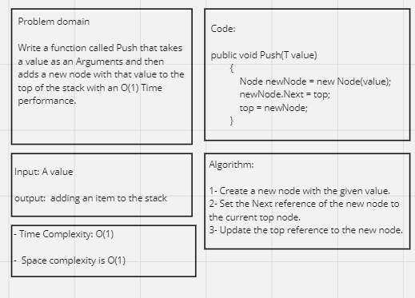
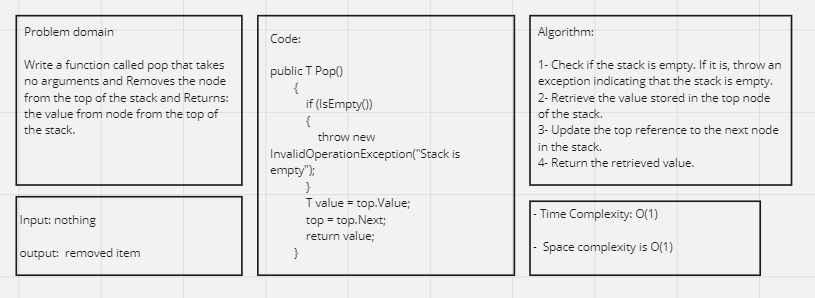
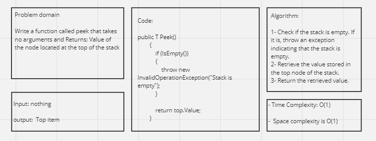
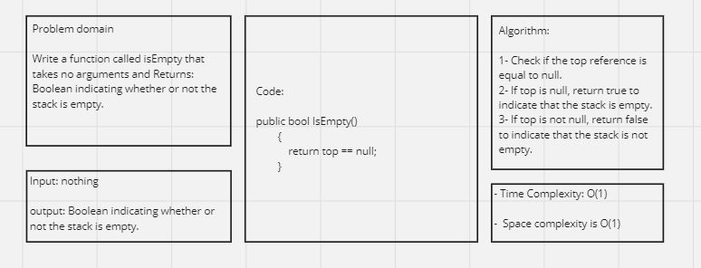
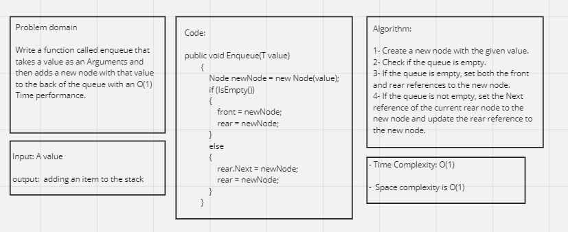
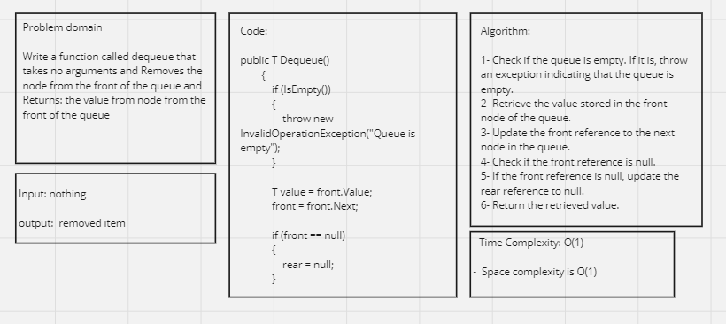
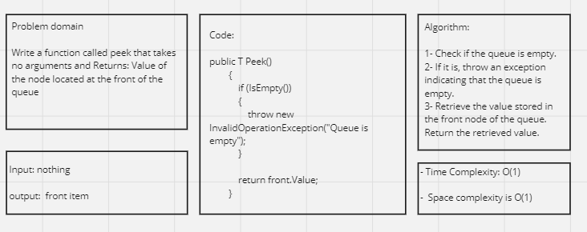
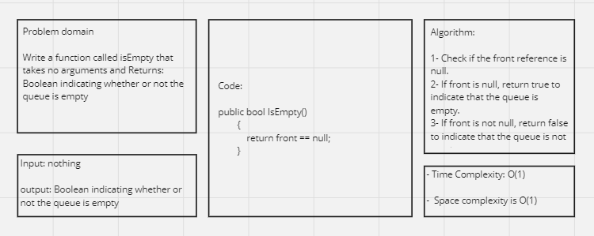

# Stack & Queue Implementation(1)

## Whiteboard Process 

### Stack 






### Queue






---

## Approach & Efficiency

For both the Stack and Queue implementations, we are using a Linked List as the underlying data structure.

**Stack:**

1. The Stack class has a top property that points to the top node of the stack.
2. When a new node is pushed onto the stack using the push method, it is added to the top of the stack with O(1) time complexity.
3. When a node is popped from the stack using the pop method, the value is retrieved from the top node, the top reference is updated to the next node, and the removed node is discarded. All these operations have O(1) time complexity.
4. The peek method retrieves the value from the top node without removing it, also with O(1) time complexity.
5. The isEmpty method checks if the top reference is null to determine if the stack is empty, which has O(1) time complexity.

**Queue:**

1. The Queue class has a front property that points to the front node of the queue.
2. When a new node is enqueued into the queue using the enqueue method, it is added to the back of the queue with O(1) time complexity.
3. When a node is dequeued from the queue using the dequeue method, the value is retrieved from the front node, the front reference is updated to the next node, and the removed node is discarded. All these operations have O(1) time complexity.
4. The peek method retrieves the value from the front node without removing it, also with O(1) time complexity.
5. The isEmpty method checks if the front reference is null to determine if the queue is empty, which has O(1) time complexity.

Overall, both the Stack and Queue implementations have efficient O(1) time complexity for all their operations, including pushing, popping, peeking, and checking if they are empty. The space complexity is also O(1) as the memory usage remains constant regardless of the number of elements in the Stack or Queue.

---

## Solution

Stack Code:

```shell
public class StackClass<T>
    {
        private class Node
        {
            public T Value { get; set; }
            public Node Next { get; set; }

            public Node(T value)
            {
                Value = value;
                Next = null;
            }
        }

        private Node top;

        public StackClass()
        {
            top = null;
        }

        public void Push(T value)
        {
            Node newNode = new Node(value);
            newNode.Next = top;
            top = newNode;
        }

        public T Pop()
        {
            if (IsEmpty())
            {
                throw new InvalidOperationException("Stack is empty");
            }

            T value = top.Value;
            top = top.Next;
            return value;
        }

        public T Peek()
        {
            if (IsEmpty())
            {
                throw new InvalidOperationException("Stack is empty");
            }

            return top.Value;
        }

        public bool IsEmpty()
        {
            return top == null;
        }
    }
```

Queue Code:

```shell
public class QueueClass<T>
    {
        private class Node
        {
            public T Value { get; set; }
            public Node Next { get; set; }

            public Node(T value)
            {
                Value = value;
                Next = null;
            }
        }

        private Node front;
        private Node rear;

        public QueueClass()
        {
            front = null;
            rear = null;
        }

        public void Enqueue(T value)
        {
            Node newNode = new Node(value);
            if (IsEmpty())
            {
                front = newNode;
                rear = newNode;
            }
            else
            {
                rear.Next = newNode;
                rear = newNode;
            }
        }

        public T Dequeue()
        {
            if (IsEmpty())
            {
                throw new InvalidOperationException("Queue is empty");
            }

            T value = front.Value;
            front = front.Next;

            if (front == null)
            {
                rear = null;
            }

            return value;
        }

        public T Peek()
        {
            if (IsEmpty())
            {
                throw new InvalidOperationException("Queue is empty");
            }

            return front.Value;
        }

        public bool IsEmpty()
        {
            return front == null;
        }
    }
```

Main function Code with result:

```shell
static void Main(string[] args)
        {
            StackClass<int> stack = new StackClass<int>();
            stack.Push(1);
            stack.Push(2);
            stack.Push(3);

            Console.WriteLine(stack.Peek());  // Output: 3

            Console.WriteLine(stack.Pop());   // Output: 3
            Console.WriteLine(stack.Pop());   // Output: 2
            Console.WriteLine(stack.Pop());   // Output: 1

            Console.WriteLine(stack.IsEmpty());  // Output: True


            QueueClass<string> queue = new QueueClass<string>();
            queue.Enqueue("Apple");
            queue.Enqueue("Banana");
            queue.Enqueue("Cherry");

            Console.WriteLine(queue.Peek());   // Output: Apple

            Console.WriteLine(queue.Dequeue());   // Output: Apple
            Console.WriteLine(queue.Dequeue());   // Output: Banana
            Console.WriteLine(queue.Dequeue());   // Output: Cherry

            Console.WriteLine(queue.IsEmpty());  // Output: True
        }
```

---

## Test Cases

Stack's Test Cases:

```shell
public class StackTest
    {
        [Fact]
        public void Push_SingleValue_SuccessfullyPushed()
        {
            // Arrange
            StackClass<int> stack = new StackClass<int>();

            // Act
            stack.Push(5);

            // Assert
            Assert.Equal(5, stack.Peek());
        }

        [Fact]
        public void Push_MultipleValues_SuccessfullyPushed()
        {
            // Arrange
            StackClass<int> stack = new StackClass<int>();

            // Act
            stack.Push(5);
            stack.Push(10);
            stack.Push(15);

            // Assert
            Assert.Equal(15, stack.Peek());
        }

        [Fact]
        public void Pop_SuccessfulPop()
        {
            // Arrange
            StackClass<int> stack = new StackClass<int>();
            stack.Push(5);
            stack.Push(10);
            stack.Push(15);

            // Act
            int poppedValue = stack.Pop();

            // Assert
            Assert.Equal(15, poppedValue);
            Assert.Equal(10, stack.Peek());
        }

        [Fact]
        public void Pop_EmptyStack_ThrowsException()
        {
            // Arrange
            StackClass<int> stack = new StackClass<int>();

            // Act and Assert
            Assert.Throws<InvalidOperationException>(() => stack.Pop());
        }

        [Fact]
        public void Peek_SuccessfulPeek()
        {
            // Arrange
            StackClass<int> stack = new StackClass<int>();
            stack.Push(5);
            stack.Push(10);
            stack.Push(15);

            // Act
            int peekedValue = stack.Peek();

            // Assert
            Assert.Equal(15, peekedValue);
        }

        [Fact]
        public void Peek_EmptyStack_ThrowsException()
        {
            // Arrange
            StackClass<int> stack = new StackClass<int>();

            // Act and Assert
            Assert.Throws<InvalidOperationException>(() => stack.Peek());
        }

        [Fact]
        public void IsEmpty_EmptyStack_ReturnsTrue()
        {
            // Arrange
            StackClass<int> stack = new StackClass<int>();

            // Act and Assert
            Assert.True(stack.IsEmpty());
        }

        [Fact]
        public void IsEmpty_NonEmptyStack_ReturnsFalse()
        {
            // Arrange
            StackClass<int> stack = new StackClass<int>();
            stack.Push(5);

            // Act and Assert
            Assert.False(stack.IsEmpty());
        }
    }
```

Queue's Test Cases:

```shell
public class QueueTest
    {
        [Fact]
        public void Enqueue_SingleValue_SuccessfullyEnqueued()
        {
            // Arrange
            QueueClass<string> queue = new QueueClass<string>();

            // Act
            queue.Enqueue("Apple");

            // Assert
            Assert.Equal("Apple", queue.Peek());
        }

        [Fact]
        public void Enqueue_MultipleValues_SuccessfullyEnqueued()
        {
            // Arrange
            QueueClass<string> queue = new QueueClass<string>();

            // Act
            queue.Enqueue("Apple");
            queue.Enqueue("Banana");
            queue.Enqueue("Cherry");

            // Assert
            Assert.Equal("Apple", queue.Peek());
        }

        [Fact]
        public void Dequeue_SuccessfulDequeue()
        {
            // Arrange
            QueueClass<string> queue = new QueueClass<string>();
            queue.Enqueue("Apple");
            queue.Enqueue("Banana");
            queue.Enqueue("Cherry");

            // Act
            string dequeuedValue = queue.Dequeue();

            // Assert
            Assert.Equal("Apple", dequeuedValue);
            Assert.Equal("Banana", queue.Peek());
        }

        [Fact]
        public void Dequeue_EmptyQueue_ThrowsException()
        {
            // Arrange
            QueueClass<string> queue = new QueueClass<string>();

            // Act and Assert
            Assert.Throws<InvalidOperationException>(() => queue.Dequeue());
        }

        [Fact]
        public void Peek_SuccessfulPeek()
        {
            // Arrange
            QueueClass<string> queue = new QueueClass<string>();
            queue.Enqueue("Apple");
            queue.Enqueue("Banana");
            queue.Enqueue("Cherry");

            // Act
            string peekedValue = queue.Peek();

            // Assert
            Assert.Equal("Apple", peekedValue);
        }

        [Fact]
        public void Peek_EmptyQueue_ThrowsException()
        {
            // Arrange
            QueueClass<string> queue = new QueueClass<string>();

            // Act and Assert
            Assert.Throws<InvalidOperationException>(() => queue.Peek());
        }

        [Fact]
        public void IsEmpty_EmptyQueue_ReturnsTrue()
        {
            // Arrange
            QueueClass<string> queue = new QueueClass<string>();

            // Act and Assert
            Assert.True(queue.IsEmpty());
        }

        [Fact]
        public void IsEmpty_NonEmptyQueue_ReturnsFalse()
        {
            // Arrange
            QueueClass<string> queue = new QueueClass<string>();
            queue.Enqueue("Apple");

            // Act and Assert
            Assert.False(queue.IsEmpty());
        }
    }
```
