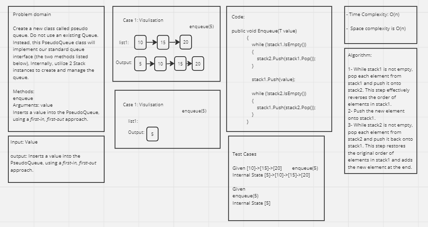
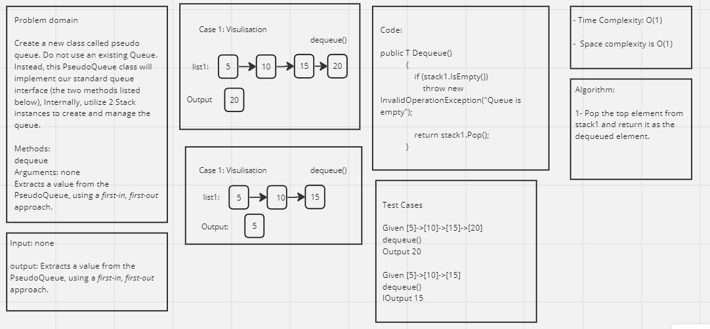

# Implement a Queue using two Stacks.

## Whiteboard Process 




---

## Approach & Efficiency

The approach for implementing the PseudoQueue class using two stacks is based on the idea of maintaining the first-in, first-out (FIFO) order of elements. Here's a breakdown of the approach and its efficiency:

**Enqueue:**

* The enqueue method involves transferring all the elements from stack1 to stack2, pushing the new element onto stack1, and then transferring the elements back to stack1 from stack2.
* In the worst case, when all the elements are present in stack1, the transfer process involves iterating through all the elements twice.
* Time complexity: O(n), where n is the number of elements in the queue.
* Space complexity: O(n), as both stack1 and stack2 may temporarily hold all the elements during the transfer process.

**Dequeue:**

* The dequeue method simply performs a pop operation on stack1 to remove and return the first element in the queue.
* Since stack1 represents the front of the queue, popping an element directly from stack1 ensures the desired FIFO behavior.
* Time complexity: O(1), as it only requires a single pop operation from stack1.
* Space complexity: O(1), as no additional memory is used apart from the existing stacks.

The overall efficiency of the PseudoQueue code depends on the number of elements in the queue. Enqueue operations have a time and space complexity of O(n) since they involve transferring elements between two stacks. Dequeue operations, on the other hand, have a time and space complexity of O(1) since they directly pop an element from stack1.

---

## Solution

Code:
```shell
public class StackClass<T>
    {
            private List<T> items;

            public StackClass()
            {
                items = new List<T>();
            }

            public void Push(T item)
            {
                items.Add(item);
            }

            public T Pop()
            {
                if (IsEmpty())
                    throw new InvalidOperationException("Stack is empty");

                T item = items[items.Count - 1];
                items.RemoveAt(items.Count - 1);
                return item;
            }

            public T Peek()
            {
                if (IsEmpty())
                    throw new InvalidOperationException("Stack is empty");

                return items[items.Count - 1];
            }

            public bool IsEmpty()
            {
                return items.Count == 0;
            }
        }

        public class PseudoQueue<T>
        {
            private StackClass<T> stack1;
            private StackClass<T> stack2;

            public PseudoQueue()
            {
                stack1 = new StackClass<T>();
                stack2 = new StackClass<T>();
            }

            public void Enqueue(T value)
            {
                while (!stack1.IsEmpty())
                {
                    stack2.Push(stack1.Pop());
                }

                stack1.Push(value);

                while (!stack2.IsEmpty())
                {
                    stack1.Push(stack2.Pop());
                }
            }

            public T Dequeue()
            {
                if (stack1.IsEmpty())
                    throw new InvalidOperationException("Queue is empty");

                return stack1.Pop();
            }
        }
```

The main method and result:

```shell
static void Main(string[] args)
        {
            PseudoQueue<int> pseudoQueue = new PseudoQueue<int>();

            pseudoQueue.Enqueue(10);
            pseudoQueue.Enqueue(15);
            pseudoQueue.Enqueue(20);

            Console.WriteLine("Internal State after enqueue:");
            Console.WriteLine(pseudoQueue.Dequeue()); // Output: 10
            Console.WriteLine(pseudoQueue.Dequeue()); // Output: 15

            pseudoQueue.Enqueue(5);

            Console.WriteLine("Internal State after enqueue and dequeue:");
            Console.WriteLine(pseudoQueue.Dequeue()); // Output: 20
            Console.WriteLine(pseudoQueue.Dequeue()); // Output: 5

            // Trying to dequeue from an empty queue
            try
            {
                pseudoQueue.Dequeue();
            }
            catch (InvalidOperationException ex)
            {
                Console.WriteLine(ex.Message); // Output: Queue is empty
            }
        }
```

---

## Test Cases

```shell
public class UnitTest1
    {
        [Fact]
        public void Enqueue_ShouldAddElementToQueue()
        {
            PseudoQueue<int> pseudoQueue = new PseudoQueue<int>();

            pseudoQueue.Enqueue(10);
            pseudoQueue.Enqueue(20);

            Assert.Equal(10, pseudoQueue.Dequeue());
            Assert.Equal(20, pseudoQueue.Dequeue());
        }

        [Fact]
        public void Dequeue_ShouldRemoveAndReturnFirstElementInQueue()
        {
            PseudoQueue<int> pseudoQueue = new PseudoQueue<int>();

            pseudoQueue.Enqueue(5);
            pseudoQueue.Enqueue(10);
            pseudoQueue.Enqueue(15);

            Assert.Equal(5, pseudoQueue.Dequeue());
            Assert.Equal(10, pseudoQueue.Dequeue());
            Assert.Equal(15, pseudoQueue.Dequeue());
        }

        [Fact]
        public void Dequeue_ShouldThrowException_WhenQueueIsEmpty()
        {
            PseudoQueue<int> pseudoQueue = new PseudoQueue<int>();

            Assert.Throws<InvalidOperationException>(() => pseudoQueue.Dequeue());
        }
    }
```
