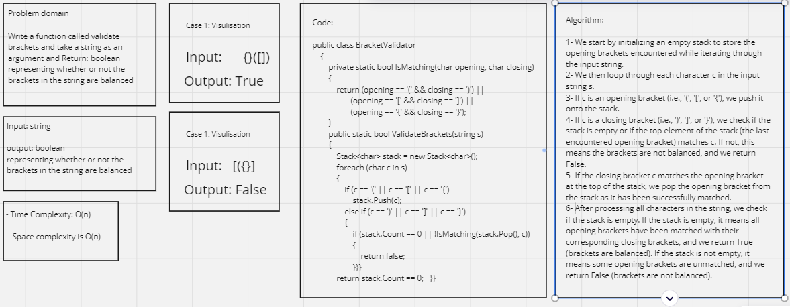

# Stack Queue Brackets

## Whiteboard Process 



---

## Approach & Efficiency

**Approach:**

The approach to validate balanced brackets involves using a stack data structure to keep track of opening brackets encountered while iterating through the input string. For each character in the string, we handle two cases: if it is an opening bracket, we push it onto the stack, and if it is a closing bracket, we check if it matches the top element of the stack (the last encountered opening bracket). If they match, we pop the opening bracket from the stack, indicating a successful match. If they don't match or the stack is empty when encountering a closing bracket, it means the brackets are not balanced, and we return False. After processing all characters, we check if the stack is empty; if it is, all opening brackets have been matched, and we return True (brackets are balanced); otherwise, we return False (brackets are not balanced).

**Efficiency:**

Time Complexity: The time complexity of the ValidateBrackets function is O(n), where n is the length of the input string s. This is because the function iterates through the entire string once, and each character is processed in constant time (pushing, popping, or checking the stack).
Space Complexity: The space complexity of the ValidateBrackets function is O(n), where n is the length of the input string s. This is due to the usage of the stack to keep track of opening brackets encountered during the iteration. In the worst case, the stack can contain all the opening brackets of the input string if there are no matching closing brackets, leading to a space complexity proportional to the length of the input string. The additional space used by the stack grows linearly with the size of the input string.

---

## Solution

The Code:

```shell
public class BracketValidator
    {
        private static bool IsMatching(char opening, char closing)
        {
            // Helper function to check if opening and closing brackets match
            return (opening == '(' && closing == ')') ||
                   (opening == '[' && closing == ']') ||
                   (opening == '{' && closing == '}');
        }

        public static bool ValidateBrackets(string s)
        {
            Stack<char> stack = new Stack<char>();
            foreach (char c in s)
            {
                if (c == '(' || c == '[' || c == '{')
                {
                    stack.Push(c);
                }
                else if (c == ')' || c == ']' || c == '}')
                {
                    if (stack.Count == 0 || !IsMatching(stack.Pop(), c))
                    {
                        return false;
                    }
                }
            }

            // If there are any unmatched opening brackets left in the stack, return false
            return stack.Count == 0;
        }
    }
```

The main function and result:

```shell
static void Main(string[] args)
        {
            Console.WriteLine(BracketValidator.ValidateBrackets("{}"));  // Output: True
            Console.WriteLine(BracketValidator.ValidateBrackets("{}(){}"));  // Output: True
            Console.WriteLine(BracketValidator.ValidateBrackets("()[[Extra Characters]]"));  // Output: True
            Console.WriteLine(BracketValidator.ValidateBrackets("(){}[[]]"));  // Output: True
            Console.WriteLine(BracketValidator.ValidateBrackets("{}{Code}[Fellows](())"));  // Output: True
            Console.WriteLine(BracketValidator.ValidateBrackets("[({}]"));  // Output: False
            Console.WriteLine(BracketValidator.ValidateBrackets("(]"));  // Output: False
            Console.WriteLine(BracketValidator.ValidateBrackets("{(})"));  // Output: False
        }
```

---

## Test Cases

```shell
public class UnitTest1
    {
        [Fact]
        public void TestValidBrackets()
        {
            // Happy Path - Expected outcome
            Assert.True(BracketValidator.ValidateBrackets("{}"));
            Assert.True(BracketValidator.ValidateBrackets("{}(){}"));
            Assert.True(BracketValidator.ValidateBrackets("()[[Extra Characters]]"));
            Assert.True(BracketValidator.ValidateBrackets("(){}[[]]"));
            Assert.True(BracketValidator.ValidateBrackets("{}{Code}[Fellows](())"));
        }

        [Fact]
        public void TestInvalidBrackets()
        {
            // Expected failure
            Assert.False(BracketValidator.ValidateBrackets("[({}]"));
            Assert.False(BracketValidator.ValidateBrackets("(]"));
            Assert.False(BracketValidator.ValidateBrackets("{(})"));
        }

        [Fact]
        public void TestEdgeCase()
        {
            // Edge Case: Empty string should be considered balanced
            Assert.True(BracketValidator.ValidateBrackets(""));

            // Edge Case: Single type of bracket should be considered unbalanced
            Assert.False(BracketValidator.ValidateBrackets("(((((("));
        }
    }
```
