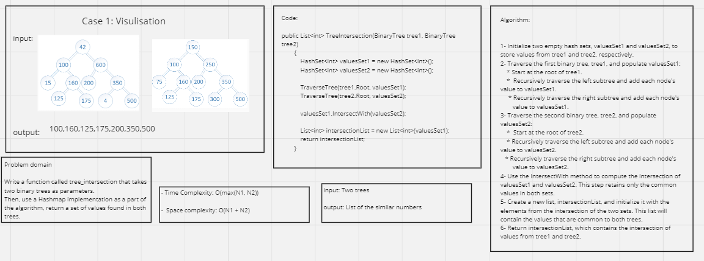

# Tree Intersection

## Whiteboard Process 



---

## Approach & Efficiency

**Approach:**

The approach used in this code involves the following steps:

1- Traversal: Both binary trees, tree1 and tree2, are traversed in an in-order manner using recursive depth-first traversal. During traversal, the values of the nodes are stored in two separate hash sets, valuesSet1 and valuesSet2.

2- Intersection: The IntersectWith method of HashSet is used to compute the intersection of valuesSet1 and valuesSet2. This step identifies the common values between the two sets, which represent the intersection of values found in both trees.

3- Result List: The common values are then converted into a list, intersectionList, which is returned as the final result.

**Efficiency:**

1- Time Complexity:

* The time complexity of traversing each tree is O(N), where N is the number of nodes in the respective tree.
* Computing the intersection of two hash sets using IntersectWith typically takes O(min(N1, N2)) time in practice.
* Creating the intersectionList from the intersection set takes O(min(N1, N2)) time.

Therefore, the overall time complexity is dominated by the traversal of the larger tree, so it's O(max(N1, N2)), where N1 and N2 are the numbers of nodes in tree1 and tree2.

2- Space Complexity:

* The space used for valuesSet1 is proportional to the number of distinct values in tree1, which is at most N1. Therefore, its space complexity is O(N1).
* The space used for valuesSet2 is proportional to the number of distinct values in tree2, which is at most N2. Therefore, its space complexity is O(N2).
* The space used for intersectionList is proportional to the number of elements in the intersection set, which is at most min(N1, N2). Therefore, its space complexity is O(min(N1, N2)).

The overall space complexity is dominated by the space used for the hash sets, so it's O(N1 + N2), where N1 and N2 are the numbers of nodes in tree1 and tree2.

---

## Solution

Function code:

```shell
public List<int> TreeIntersection(BinaryTree tree1, BinaryTree tree2)
        {
            HashSet<int> valuesSet1 = new HashSet<int>();
            HashSet<int> valuesSet2 = new HashSet<int>();

            TraverseTree(tree1.Root, valuesSet1);
            TraverseTree(tree2.Root, valuesSet2);

            valuesSet1.IntersectWith(valuesSet2);

            List<int> intersectionList = new List<int>(valuesSet1);
            return intersectionList;
        }
```

Main Function Code:

```shell
static void Main(string[] args)
        {
            // Create two sample binary trees
            BinaryTree tree1 = new BinaryTree();
            tree1.Root = new TreeNode(150);
            tree1.Root.Left = new TreeNode(100);
            tree1.Root.Right = new TreeNode(250);
            tree1.Root.Left.Left = new TreeNode(75);
            tree1.Root.Left.Right = new TreeNode(160);
            tree1.Root.Right.Left = new TreeNode(200);
            tree1.Root.Right.Right = new TreeNode(350);

            BinaryTree tree2 = new BinaryTree();
            tree2.Root = new TreeNode(42);
            tree2.Root.Left = new TreeNode(100);
            tree2.Root.Right = new TreeNode(600);
            tree2.Root.Left.Left = new TreeNode(15);
            tree2.Root.Left.Right = new TreeNode(160);
            tree2.Root.Right.Left = new TreeNode(200);
            tree2.Root.Right.Right = new TreeNode(350);

            // Find the intersection of the two trees
            BinaryTree binaryTree = new BinaryTree();
            List<int> intersection = binaryTree.TreeIntersection(tree1, tree2);

            // Print the intersection values
            Console.WriteLine("Intersection of tree1 and tree2: ");
            foreach (int value in intersection)
            {
                Console.Write(value + " ");
            }
            Console.WriteLine();

            Console.ReadKey();

        }
```

## Test Cases

```shell

```
