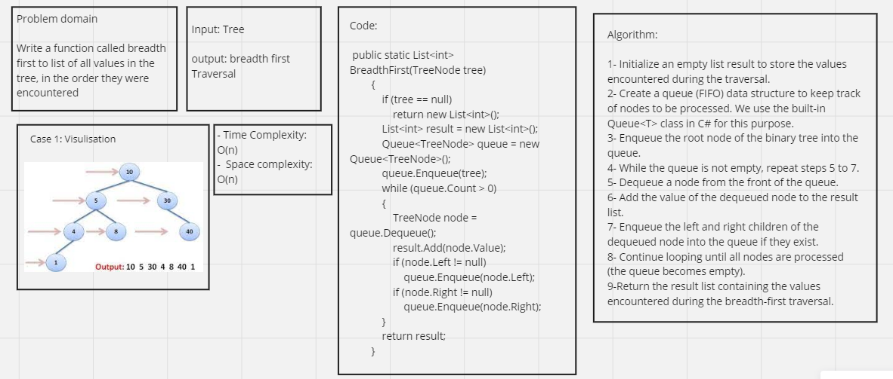

# Tree-breadth-first

## Whiteboard Process 



---

## Approach & Efficiency

**Approach:**

The approach used in the BreadthFirst algorithm is Breadth-First Search (BFS) for traversing a binary tree. BFS is an algorithm that explores a graph or tree level by level, visiting all nodes at a particular level before moving on to the next level. In the context of a binary tree, the algorithm starts from the root node and explores its immediate children (left and right), then moves on to their children, and so on. This ensures that nodes closer to the root are visited before nodes at deeper levels, making it a breadth-first traversal.

**Efficiency:**

Let's analyze the time and space complexity of the BreadthFirst algorithm:

1. Time Complexity: O(N)

* The algorithm visits each node in the binary tree exactly once.
* The while loop runs until the queue becomes empty, which takes O(N) iterations in the worst case (where N is the number of nodes in the binary tree).
* Each iteration of the loop involves dequeueing a node from the queue and enqueuing its children, which takes constant time for each node.
* Overall, the time complexity is O(N) since we perform a constant-time operation for each of the N nodes.

2. Space Complexity: O(W) or O(N)

* The space complexity of the algorithm mainly depends on the maximum width (number of nodes in a level with the most nodes) of the binary tree.
* In the worst case, the queue can hold all nodes at the deepest level of the binary tree. Therefore, the space complexity of the queue is O(W), where W is the maximum width of the tree.
* Additionally, the result list stores the values encountered during the traversal, so its space complexity is O(N) since it contains N elements (where N is the number of nodes in the binary tree).
* Overall, the space complexity is O(max(W, N)), where W is the maximum width of the tree and N is the number of nodes in the binary tree.

In practice, the space complexity is usually dominated by the number of nodes in the binary tree (O(N)), and the algorithm is efficient for most practical scenarios.

---

## Solution

The Function Code:

```shell
public static List<int> BreadthFirst(TreeNode tree)
        {
            if (tree == null)
                return new List<int>();

            List<int> result = new List<int>();
            Queue<TreeNode> queue = new Queue<TreeNode>();
            queue.Enqueue(tree);

            while (queue.Count > 0)
            {
                TreeNode node = queue.Dequeue();
                result.Add(node.Value);

                if (node.Left != null)
                    queue.Enqueue(node.Left);

                if (node.Right != null)
                    queue.Enqueue(node.Right);
            }

            return result;
        }
```

The Mian Function Code:

```shell
static void Main(string[] args)
        {
            // Create a simple binary tree
            TreeNode root = new TreeNode(1)
            {
                Left = new TreeNode(2)
                {
                    Left = new TreeNode(4),
                    Right = new TreeNode(5)
                },
                Right = new TreeNode(3)
                {
                    Left = new TreeNode(6),
                    Right = new TreeNode(7)
                }
            };

            // Call the function and get the result
            List<int> resultList = TreeTraversal.BreadthFirst(root);
            foreach (int value in resultList)
            {
                Console.Write(value + " "); // Output: 1 2 3 4 5 6 7
            }
        }
```

---

## Test Cases

```shell
public class UnitTest1
    {
        private TreeNode CreateTree()
        {
            TreeNode root = new TreeNode(1)
            {
                Left = new TreeNode(2)
                {
                    Left = new TreeNode(4),
                    Right = new TreeNode(5)
                },
                Right = new TreeNode(3)
                {
                    Left = new TreeNode(6),
                    Right = new TreeNode(7)
                }
            };

            return root;
        }

        [Fact]
        public void TestEmptyTree()
        {
            TreeNode root = null;
            List<int> expected = new List<int>();
            List<int> actual = TreeTraversal.BreadthFirst(root);
            Assert.Equal(expected, actual);
        }

        [Fact]
        public void TestSingleRootNode()
        {
            TreeNode root = new TreeNode(1);
            List<int> expected = new List<int> { 1 };
            List<int> actual = TreeTraversal.BreadthFirst(root);
            Assert.Equal(expected, actual);
        }

        [Fact]
        public void TestMultipleNodes()
        {
            TreeNode root = CreateTree();
            List<int> expected = new List<int> { 1, 2, 3, 4, 5, 6, 7 };
            List<int> actual = TreeTraversal.BreadthFirst(root);
            Assert.Equal(expected, actual);
        }
```
