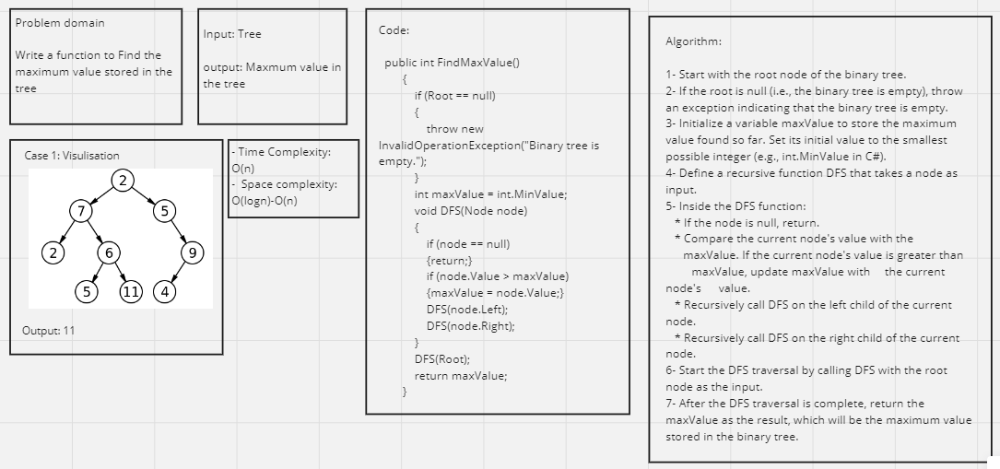

# Tree-max

## Whiteboard Process 



---

## Approach & Efficiency

**Approach:**

The approach used in the program to find the maximum value stored in the binary tree is a Depth-First Search (DFS) traversal. The method starts at the root node and recursively visits all the nodes in the binary tree while keeping track of the maximum value seen so far. This approach ensures that every node is visited exactly once, and the maximum value stored in the binary tree is found by comparing the node values during the traversal.

**Efficiency:**

1. Time Complexity:

* The time complexity of the FindMaxValue method is O(N), where N is the number of nodes in the binary tree. This is because the algorithm visits each node exactly once during the DFS traversal. In the worst-case scenario, the method needs to visit all N nodes to find the maximum value.

2. Space Complexity:

* The space complexity of the FindMaxValue method is O(H), where H is the height of the binary tree. This is due to the recursive nature of the DFS algorithm. In the worst-case scenario, the binary tree is a skewed tree (e.g., a linked list), and its height becomes N (the number of nodes). In this case, the method will use O(N) space in the call stack. However, in a balanced binary tree, the height is log(N), leading to a space complexity of O(log N).
* Apart from the call stack space, the method uses a constant amount of extra space for variables maxValue and other temporary variables during the traversal. Therefore, the overall space complexity is O(H) to O(N) depending on the height of the binary tree.

The algorithm is efficient and can find the maximum value in a binary tree in linear time, visiting each node once. However, the space complexity depends on the height of the binary tree, and in the worst-case scenario, it can be as high as O(N) for a skewed tree. For a balanced binary tree, the space complexity is more favorable at O(log N).

## Solution

The Function Code:

```shell
public int FindMaxValue()
        {
            if (Root == null)
            {
                throw new InvalidOperationException("Binary tree is empty.");
            }

            int maxValue = int.MinValue;

            void DFS(Node node)
            {
                if (node == null)
                {
                    return;
                }

                // Update the maxValue if the current node's value is greater
                if (node.Value > maxValue)
                {
                    maxValue = node.Value;
                }

                DFS(node.Left);
                DFS(node.Right);
            }

            DFS(Root);

            return maxValue;
        }
```

Main Function Code:

```shell
BinaryTree tree = new BinaryTree();
            tree.Root = new Node(5);
            tree.Root.Left = new Node(3);
            tree.Root.Right = new Node(8);
            tree.Root.Left.Left = new Node(1);
            tree.Root.Left.Right = new Node(4);
            tree.Root.Right.Left = new Node(7);
            tree.Root.Right.Right = new Node(9);

            int max = tree.FindMaxValue();
            Console.WriteLine("Maximum value in the binary tree: " + max);  // Output: 9
```

## Test Cases

```shell
[Fact]
        public void TestFindMaxValue()
        {
            // Create the binary tree
            BinaryTree tree = new BinaryTree();
            tree.Root = new Node(5);
            tree.Root.Left = new Node(3);
            tree.Root.Right = new Node(8);
            tree.Root.Left.Left = new Node(1);
            tree.Root.Left.Right = new Node(4);
            tree.Root.Right.Left = new Node(7);
            tree.Root.Right.Right = new Node(9);

            // Test with a non-empty binary tree
            int max = tree.FindMaxValue();
            Assert.Equal(9, max);

            // Test with a binary tree with negative values
            tree.Root.Value = -5;
            tree.Root.Left.Value = -3;
            tree.Root.Right.Value = -8;
            tree.Root.Left.Left.Value = -1;
            tree.Root.Left.Right.Value = -4;
            tree.Root.Right.Left.Value = -7;
            tree.Root.Right.Right.Value = -9;
            max = tree.FindMaxValue();
            Assert.Equal(-1, max);

            // Test with a binary tree containing only one node
            tree.Root = new Node(42);
            max = tree.FindMaxValue();
            Assert.Equal(42, max);

            // Test with an empty binary tree (expect an exception)
            tree.Root = null;
            Assert.Throws<InvalidOperationException>(() => tree.FindMaxValue());
        }
```
