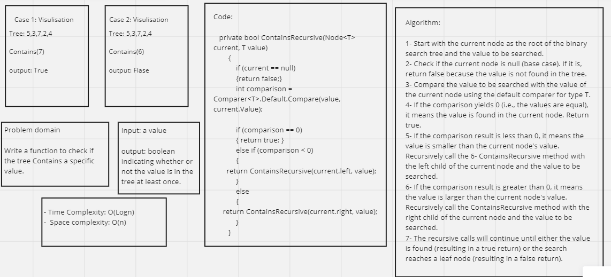

# Trees

## Whiteboard Process 




---

## Approach & Efficiency

**Approach:**

* The BinaryTree<T> class is implemented to store elements in a binary tree data structure. It contains a nested Node<T> class representing individual nodes, with properties for the value, left child node, and right child node.
* The Add method is implemented to add a new node with a given value to the binary tree, maintaining the binary search tree property (left child contains smaller values, right child contains larger values).
* The Contains method is implemented to check whether a given value exists in the binary tree. It uses a recursive approach to search for the value by comparing it with the values in each node.
* The three depth-first traversal methods (PreorderTraversal, InorderTraversal, PostorderTraversal) perform different types of depth-first traversal on the binary tree and return arrays of values representing the traversal order.

**Efficiency Analysis:**

* Adding a new node (using Add method):
  * Time Complexity: O(log n) to O(n) depending on the balance of the binary search tree. In the best-case scenario, when the tree is balanced, the time complexity is O(log n). In the worst-case scenario, when the tree is completely skewed, the time complexity is O(n).
  * Space Complexity: O(h), where "h" is the height of the binary search tree. In the best-case scenario (balanced tree), the space complexity is O(log n), and in the worst-case scenario (skewed tree), it is O(n).

* Checking for a value (using Contains method):
  * Time Complexity: O(log n) to O(n) depending on the balance of the binary search tree. In the best-case scenario (balanced tree), the time complexity is O(log n). In the worst-case scenario (skewed tree), the time complexity is O(n).
  * Space Complexity: O(h), where "h" is the height of the binary search tree. In the best-case scenario (balanced tree), the space complexity is O(log n), and in the worst-case scenario (skewed tree), it is O(n).

* Depth-First Traversals (PreorderTraversal, InorderTraversal, PostorderTraversal):
  * Time Complexity: O(n), as each traversal method visits each node exactly once.
  * Space Complexity: O(h), where "h" is the height of the binary tree. In the best-case scenario (balanced tree), the space complexity is O(log n), and in the worst-case scenario (skewed tree), it is O(n).


In conclusion, the efficiency of the program depends on the balance of the binary search tree. In well-balanced trees, the time and space complexity for adding new nodes and checking for values is generally more efficient (closer to O(log n)). In poorly balanced or skewed trees, the efficiency may degrade to O(n) for both operations. The depth-first traversal methods have a time complexity of O(n) as they visit each node once, and their space complexity depends on the height of the binary tree (O(h)).

---

## Solution

Traversal Code: 

```shell
public class BinaryTree<T>
    {
        public Node<T> root;
        public BinaryTree()
        {
            root = null;
        }

        public void Add(T value)
        {
            root = AddRecursive(root, value);
        }

        private Node<T> AddRecursive(Node<T> current, T value)
        {
            if (current == null)
            {
                return new Node<T>(value);
            }

            if (Comparer<T>.Default.Compare(value, current.Value) < 0)
            {
                current.left = AddRecursive(current.left, value);
            }
            else
            {
                current.right = AddRecursive(current.right, value);
            }

            return current;
        }


        public T[] PreorderTraversal()
        {
            List<T> result = new List<T>();
            PreorderTraversalRecursive(root, result);
            return result.ToArray();
        }


        private void PreorderTraversalRecursive(Node<T> node, List<T> result)
        {
            if (node != null)
            {
                result.Add(node.Value);
                PreorderTraversalRecursive(node.left, result);
                PreorderTraversalRecursive(node.right, result);
            }
        }


        // Method for in-order traversal
        public T[] InorderTraversal()
        {
            List<T> result = new List<T>();
            InorderTraversalRecursive(root, result);
            return result.ToArray();
        }

        private void InorderTraversalRecursive(Node<T> node, List<T> result)
        {
            if (node != null)
            {
                InorderTraversalRecursive(node.left, result);
                result.Add(node.Value);
                InorderTraversalRecursive(node.right, result);
            }
        }

        // Method for post-order traversal
        public T[] PostorderTraversal()
        {
            List<T> result = new List<T>();
            PostorderTraversalRecursive(root, result);
            return result.ToArray();
        }

        private void PostorderTraversalRecursive(Node<T> node, List<T> result)
        {
            if (node != null)
            {
                PostorderTraversalRecursive(node.left, result);
                PostorderTraversalRecursive(node.right, result);
                result.Add(node.Value);
            }
        }
    }
```

Add and Contain Methdods:

```shell
public class BinarySearchTree<T>:BinaryTree<T>
    {
        public void Add(T value)
        {
            root = AddRecursive(root, value);
        }

        private Node<T> AddRecursive(Node<T> current, T value)
        {
            if (current == null)
            {
                return new Node<T>(value);
            }

            if (Comparer<T>.Default.Compare(value, current.Value) < 0)
            {
                current.left = AddRecursive(current.left, value);
            }
            else if (Comparer<T>.Default.Compare(value, current.Value) > 0)
            {
                current.right = AddRecursive(current.right, value);
            }

            return current;
        }

        public bool Contains(T value)
        {
            return ContainsRecursive(root, value);
        }

        private bool ContainsRecursive(Node<T> current, T value)
        {
            if (current == null)
            {
                return false;
            }

            int comparison = Comparer<T>.Default.Compare(value, current.Value);

            if (comparison == 0)
            {
                return true;
            }
            else if (comparison < 0)
            {
                return ContainsRecursive(current.left, value);
            }
            else
            {
                return ContainsRecursive(current.right, value);
            }
        }
    }
```


Main Function Code:

```shell
static void Main(string[] args)
        {
            BinaryTree<int> binaryTree = new BinaryTree<int>();
            binaryTree.Add(5);
            binaryTree.Add(3);
            binaryTree.Add(7);
            binaryTree.Add(2);
            binaryTree.Add(4);

            int[] preOrderTraversalResult = binaryTree.PreorderTraversal();
            int[] inOrderTraversalResult = binaryTree.InorderTraversal();
            int[] postOrderTraversalResult = binaryTree.PostorderTraversal();

            Console.WriteLine("Pre-order traversal: " + string.Join(", ", preOrderTraversalResult));
            Console.WriteLine("In-order traversal: " + string.Join(", ", inOrderTraversalResult));
            Console.WriteLine("Post-order traversal: " + string.Join(", ", postOrderTraversalResult));

            Console.WriteLine();

            BinarySearchTree<int> bst = new BinarySearchTree<int>();
            bst.Add(5);
            bst.Add(3);
            bst.Add(7);
            bst.Add(2);
            bst.Add(4);

            bool containsValue = bst.Contains(7);
            Console.WriteLine("Contains 7? " + containsValue); // Output: Contains 7? True

            containsValue = bst.Contains(6);
            Console.WriteLine("Contains 6? " + containsValue); // Output: Contains 6? False

        }
```

## Test Cases

```shell
public class UnitTest1
    {
        [Fact]
        public void CanInstantiateEmptyTree()
        {
            // Arrange
            BinarySearchTree<int> bst = new BinarySearchTree<int>();

            // Act
            int[] preOrderTraversalResult = bst.PreorderTraversal();

            // Assert
            Assert.Empty(preOrderTraversalResult);
        }

        [Fact]
        public void CanInstantiateTreeWithSingleRootNode()
        {
            // Arrange
            BinarySearchTree<int> bst = new BinarySearchTree<int>();
            bst.Add(5);

            // Act
            int[] preOrderTraversalResult = bst.PreorderTraversal();

            // Assert
            Assert.Equal(new int[] { 5 }, preOrderTraversalResult);
        }

        [Fact]
        public void CanAddLeftAndRightChildToNodeInBinarySearchTree()
        {
            // Arrange
            BinarySearchTree<int> bst = new BinarySearchTree<int>();
            bst.Add(5);
            bst.Add(3);
            bst.Add(7);

            // Act
            int[] preOrderTraversalResult = bst.PreorderTraversal();

            // Assert
            Assert.Equal(new int[] { 5, 3, 7 }, preOrderTraversalResult);
        }

        [Fact]
        public void CanReturnCollectionFromPreorderTraversal()
        {
            // Arrange
            BinarySearchTree<int> bst = new BinarySearchTree<int>();
            bst.Add(5);
            bst.Add(3);
            bst.Add(7);
            bst.Add(2);
            bst.Add(4);

            // Act
            int[] preOrderTraversalResult = bst.PreorderTraversal();

            // Assert
            Assert.Equal(new int[] { 5, 3, 2, 4, 7 }, preOrderTraversalResult);
        }

        [Fact]
        public void CanReturnCollectionFromInorderTraversal()
        {
            // Arrange
            BinarySearchTree<int> bst = new BinarySearchTree<int>();
            bst.Add(5);
            bst.Add(3);
            bst.Add(7);
            bst.Add(2);
            bst.Add(4);

            // Act
            int[] inOrderTraversalResult = bst.InorderTraversal();

            // Assert
            Assert.Equal(new int[] { 2, 3, 4, 5, 7 }, inOrderTraversalResult);
        }

        [Fact]
        public void CanReturnCollectionFromPostorderTraversal()
        {
            // Arrange
            BinarySearchTree<int> bst = new BinarySearchTree<int>();
            bst.Add(5);
            bst.Add(3);
            bst.Add(7);
            bst.Add(2);
            bst.Add(4);

            // Act
            int[] postOrderTraversalResult = bst.PostorderTraversal();

            // Assert
            Assert.Equal(new int[] { 2, 4, 3, 7, 5 }, postOrderTraversalResult);
        }

        [Fact]
        public void ContainsMethodReturnsTrueForExistingValue()
        {
            // Arrange
            BinarySearchTree<int> bst = new BinarySearchTree<int>();
            bst.Add(5);
            bst.Add(3);
            bst.Add(7);

            // Act
            bool containsValue = bst.Contains(3);

            // Assert
            Assert.True(containsValue);
        }

        [Fact]
        public void ContainsMethodReturnsFalseForNonExistingValue()
        {
            // Arrange
            BinarySearchTree<int> bst = new BinarySearchTree<int>();
            bst.Add(5);
            bst.Add(3);
            bst.Add(7);

            // Act
            bool containsValue = bst.Contains(6);

            // Assert
            Assert.False(containsValue);
        }
    }
```
