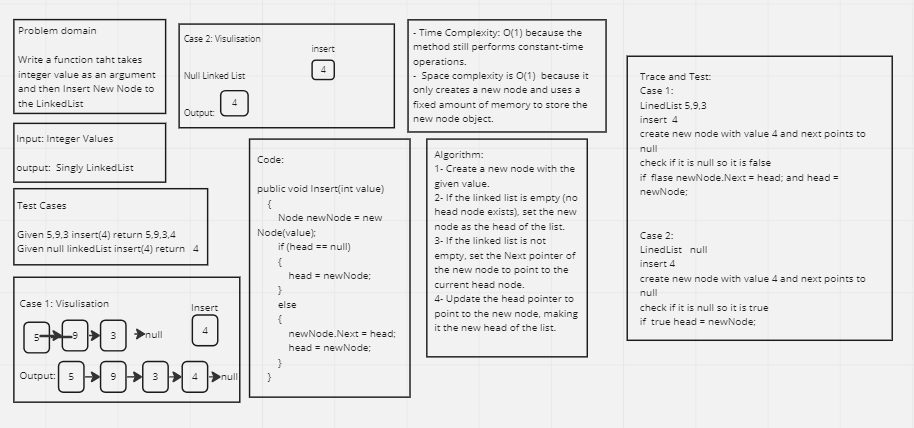
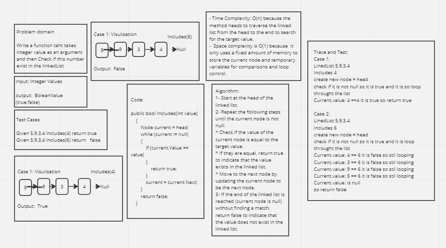
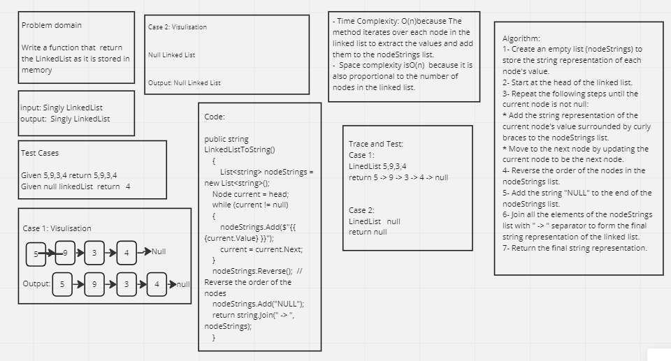

# Singly linked List Implementation

## Whiteboard Process 





---

## Approach & Efficiency

The given code implements a linked list data structure with the following methods:

1. `Insert`: Inserts a new node with the given value at the beginning of the linked list.
2. `Includes`: Checks if a value exists in the linked list by traversing the list and comparing each node's value.
3. `LinkedListToString`: Converts the linked list into a string representation by iterating over the nodes, collecting their values, and joining them with " -> " separator.

**Insert**
The Insert method has a time complexity of O(1) as it always inserts the new node at the beginning of the linked list, regardless of the list's size. It uses a constant amount of time to update the necessary pointers.

**Includes**
The Includes method has a time complexity of O(n) in the worst case, where n is the number of nodes in the linked list. It needs to traverse the list from the head to the end to check if the value exists. In the best case, the target value is found at the head, resulting in a time complexity of O(1).

**LinkedListToString**
The LinkedListToString method has a time complexity of O(n) as it needs to iterate over each node in the linked list to collect their values. The reverse operation and joining of the values have a negligible impact on the overall time complexity.

The space complexity of all the methods is O(n) as they require additional space to store the nodes' values in a list (nodeStrings). The space used by the linked list itself does not contribute significantly to the space complexity.

In summary, the given code provides an implementation of a linked list with efficient insertion, searching, and string representation functionalities.

---

## Solution


Code:

```shell
using System;
using System.Collections.Generic;

namespace HelloWorld
{
  public class Program
  {
    public static void Main(string[] args)
    {
         LinkedList myLinkedList = new LinkedList();

        // Insert nodes
        myLinkedList.Insert(3);
        myLinkedList.Insert(5);
        myLinkedList.Insert(2);

        // Check if a value exists in the linked list
        Console.WriteLine(myLinkedList.Includes(2)); // True
        Console.WriteLine(myLinkedList.Includes(4)); // False

        // Print the linked list
        Console.WriteLine(myLinkedList.LinkedListToString());
    }
 }
  
  
  public class Node
{
    public int Value { get; set; }
    public Node Next { get; set; }

    public Node(int value)
    {
        Value = value;
        Next = null;
    }
}


public class LinkedList
{
    private Node head;

    public LinkedList()
    {
        head = null;
    }

    public void Insert(int value)
    {
        Node newNode = new Node(value);
        if (head == null)
        {
            head = newNode;
        }
        else
        {
            newNode.Next = head;
            head = newNode;
        }
    }

    public bool Includes(int value)
    {
        Node current = head;
        while (current != null)
        {
            if (current.Value == value)
            {
                return true;
            }
            current = current.Next;
        }
        return false;
    }

    public string LinkedListToString()
    {
        List<string> nodeStrings = new List<string>();
    Node current = head;

    while (current != null)
    {
        nodeStrings.Add($"{{ {current.Value} }}");
        current = current.Next;
    }

    nodeStrings.Reverse();  // Reverse the order of the nodes
    nodeStrings.Add("NULL");

    return string.Join(" -> ", nodeStrings);
    }
}
}
```


The resul of the code:

```shell
True
False
{ 3 } -> { 5 } -> { 2 } -> NULL
```

---

## Test Cases

```shell
using Xunit;

namespace LinkedListTests
{
    public class LinkedListTests
    {
        [Fact]
        public void CanInstantiateEmptyLinkedList()
        {
            // Arrange
            LinkedList.LinkedList myLinkedList = new LinkedList.LinkedList();

            // Act & Assert
            Assert.Equal("NULL", myLinkedList.LinkedListToString());
        }

        [Fact]
        public void CanInsertIntoLinkedList()
        {
            // Arrange
            LinkedList.LinkedList myLinkedList = new LinkedList.LinkedList();

            // Act
            myLinkedList.Insert(5);

            // Assert
            Assert.True(myLinkedList.Includes(5));
        }

        [Fact]
        public void HeadPointsToFirstNode()
        {
            // Arrange
            LinkedList.LinkedList myLinkedList = new LinkedList.LinkedList();

            // Act
            myLinkedList.Insert(10);
            myLinkedList.Insert(20);
            myLinkedList.Insert(30);

            // Assert
            Assert.Equal(30, myLinkedList.Head.Value);
        }

        [Fact]
        public void CanInsertMultipleNodes()
        {
            // Arrange
            LinkedList.LinkedList myLinkedList = new LinkedList.LinkedList();

            // Act
            myLinkedList.Insert(1);
            myLinkedList.Insert(2);
            myLinkedList.Insert(3);

            // Assert
            Assert.True(myLinkedList.Includes(1));
            Assert.True(myLinkedList.Includes(2));
            Assert.True(myLinkedList.Includes(3));
        }

        [Fact]
        public void ValueExistsInLinkedList()
        {
            // Arrange
            LinkedList.LinkedList myLinkedList = new LinkedList.LinkedList();
            myLinkedList.Insert(5);
            myLinkedList.Insert(10);
            myLinkedList.Insert(15);

            // Act
            bool result = myLinkedList.Includes(10);

            // Assert
            Assert.True(result);
        }

        [Fact]
        public void ValueDoesNotExistInLinkedList()
        {
            // Arrange
            LinkedList.LinkedList myLinkedList = new LinkedList.LinkedList();
            myLinkedList.Insert(5);
            myLinkedList.Insert(10);
            myLinkedList.Insert(15);

            // Act
            bool result = myLinkedList.Includes(20);

            // Assert
            Assert.False(result);
        }

        [Fact]
        public void GetAllValuesInLinkedList()
        {
            // Arrange
            LinkedList.LinkedList myLinkedList = new LinkedList.LinkedList();
            myLinkedList.Insert(1);
            myLinkedList.Insert(2);
            myLinkedList.Insert(3);

            // Act
            string result = myLinkedList.LinkedListToString();

            // Assert
            Assert.Equal("{ 1 } -> { 2 } -> { 3 } -> NULL", result);
        }
    }
}
```